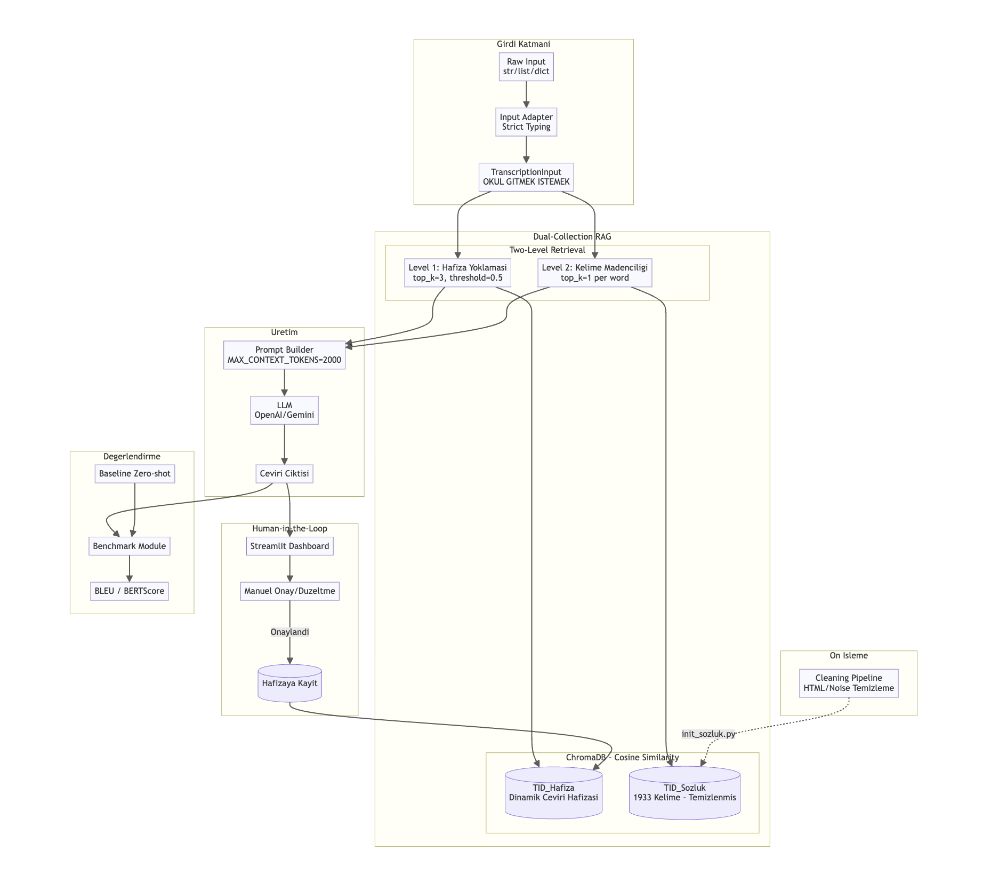
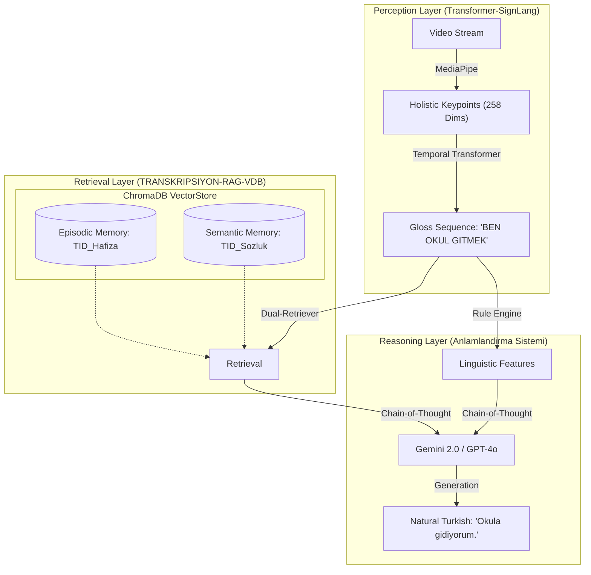
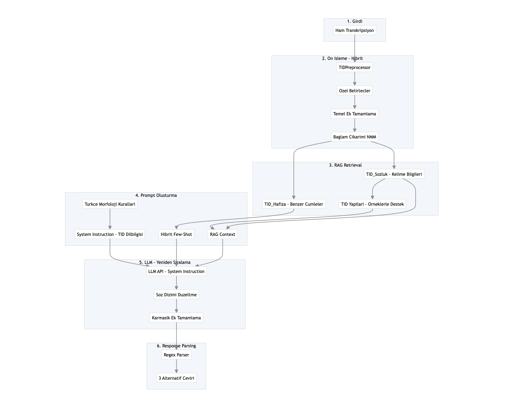

# SignTranscriber: Neuro-Symbolic Turkish Sign Language Translation System

<div align="center">


**"From Visual Perception to Semantic Understanding"**

</div>

---

## Table of Contents

1. [Vision &amp; Philosophy](#-vision--philosophy)
2. [System Architecture (Neuro-Symbolic)](#-system-architecture-neuro-symbolic)
3. [The Core Trinity (Components)](#-the-core-trinity-components)
   * [A. The Eye: Visual Perception (Transformer)](#a-the-eye-visual-perception-transformer)
   * [B. The Knowledge: Retrieval (Dual-RAG)](#b-the-knowledge-retrieval-dual-rag)
   * [C. The Brain: Interpretation (LLM + Rules)](#c-the-brain-interpretation-llm--rules)
4. [Data Ecosystem](#-data-ecosystem)
   * [Scraping Pipeline](#1-scraping-pipeline)
   * [Dictionary Structure](#2-dictionary-structure)
   * [AUTSL Statistics](#3-autsl-statistics)
5. [Scientific Evolution](#-scientific-evolution)
6. [Experiments &amp; Benchmarks](#-experiments--benchmarks)
7. [Directory Map](#-directory-map)
8. [Installation &amp; Usage](#-installation--usage)

---

## Vision & Philosophy

**SignTranscriber** is a **Neuro-Symbolic Artificial Intelligence System** designed to bridge the communication gap between the Deaf community and the hearing world.

Sign languages are not word-for-word translations of spoken languages; they are complex, independent linguistic systems with unique typologies. Turkish Sign Language (TID) typically follows a **Subject-Object-Verb (SOV)** order and uses spatial grammar rather than morphological suffixes.

**The Problem:** Purely Neural Machine Translation (NMT) fails due to data scarcity in sign languages.
**Our Solution:** **Rule-Enhanced Dual-RAG**. We combine:

1. **Neural Networks (The Eye):** To perceive the physical world (hand shapes, body pose).
2. **Symbolic AI (The Knowledge):** To retrieve explicit linguistic rules and dictionary definitions.
3. **Generative AI (The Brain):** To synthesize these inputs into fluent, grammatically correct Turkish.

---

## System Architecture (Neuro-Symbolic)

Our architecture is a vertical pipeline transforming raw pixels into semantic meaning.





---

## The Core Trinity (Components)

### A. The Eye: Visual Perception (Transformer)

**Directory:** [`transformer-signlang/`](./transformer-signlang/)

This module translates video frames into "Gloss" (sign labels).

* **Feature Extraction:** **MediaPipe Holistic** extracts **258 landmarks** per frame:
  * **Pose:** 99 dimensions (Body posture).
  * **Face:** 33 key points (Expressions).
  * **Hands:** 63 dimensions * 2 hands.
* **Model Architecture:** **Temporal Transformer Encoder**.
  * **Layers:** 6 Encoder Blocks.
  * **Attention Heads:** 8 Multi-Head Attention units.
  * **Model Dimension:** $d_{model} = 256$.
  * **Input Sequence:** Fixed length of **200 frames** (padded/truncated).
* **Dataset:** Trained on **AUTSL** (226 classes).
* **Performance:** Capable of capturing long-range temporal dependencies that LSTMs miss.

### B. The Knowledge: Retrieval (Dual-RAG)

**Directory:** [`TRANSKRIPSIYON-RAG-VDB/`](./TRANSKRIPSIYON-RAG-VDB/)

The "Memory" of the system, implementing an **Iterative Dictionary-Augmented Generation** strategy.
Based on **ChromaDB** with `paraphrase-multilingual-MiniLM-L12-v2` embeddings (384-dim).

#### The Dual-Collection Strategy:

1. **Episodic Memory (`TID_Hafiza`):**
   * Stores ~3000 verified sentence translations.
   * **Mechanism:** Finds the most semantically similar past translations to use as **Few-Shot Examples**.
   * *Effect:* "Teaches" the LLM how to conjugate verbs based on previous successes.
2. **Semantic Memory (`TID_Sozluk`):**
   * Stores ~3000 dictionary terms with metadata (Noun/Verb, Definition, Example).
   * **Mechanism:** Retrieves the exact definition of every gloss in the sentence.
   * *Effect:* Grounds the LLM, preventing hallucinations by providing ground-truth meanings.

### C. The Brain: Interpretation (LLM + Rules)

**Directory:** [`anlamlandirma-sistemi/`](./anlamlandirma-sistemi/)

The "Reasoning Engine" that orchestrates the translation.

1. **Rule-Enhanced Preprocessing (`preprocessor.py`):**
   * **Deterministic Rules:** Detects Tense (Time words), Negation (`DEGIL`, `YOK`), Questions (`MI`), and Repetition.
   * **Example:** `ARABA SURMEK SURMEK` -> Detected as "Driving continuously".
2. **Chain-of-Thought Prompting (`prompt_builder/`):**
   * Constructs a dynamic prompt containing:
     * **Persona:** Expert Interpreter.
     * **Linguistic Rules:** Extracted by the preprocessor.
     * **Context:** Retrieved from RAG.
   * **Output:** Structured JSON with Confidence Scores.



---

## Data Ecosystem

### 1. Scraping Pipeline

**Directory:** [`tid_scraper/`](./tid_scraper/)

* **Target:** TİD Güncel Sözlük (Ministry of Family and Social Services).
* **Tech:** Selenium + BeautifulSoup.
* **Output:** Downloads Video (`mp4`), Images (`jpg`), and Metadata (`json`).

### 2. Dictionary Structure

**Directory:** [`TID_Sozluk_Verileri/`](./TID_Sozluk_Verileri/)
Data is structured for RAG ingestion:

```json
/* TID_Sozluk_Verileri/Acele/data.json */
{
    "kelime": "Acele",
    "anlamlar": [
        {
            "tur": "Sıfat",
            "aciklama": "Hızlı yapılan, çabuk, tez, ivedi",
            "ornek": {
                "transkripsiyon": "BEN ANNE ACELE ACELE",
                "ceviri": "Annem çok acelecidir."
            }
        }
    ]
}
```

### 3. AUTSL Statistics

**Directory:** [`data-statistics-AULTS/`](./data-statistics-AULTS/)

* **Classes:** 226 distinct signs.
* **Analysis:** `compute_stats.py` provides reports on class imbalance, missing files, and duplicate checks (pHash).
* **Signers:** 43 different signers (ensuring generalization).

---

## Scientific Evolution

The project evolved through strict R&D phases:

1. **Genesis: The Character Pipeline** (`character-pipeline/`)
   * *Goal:* Recognize static hand shapes (A-Z letters, Numbers).
   * *Tech:* Simple CNNs + MediaPipe Hands.
   * *Result:* Good for spelling, useless for continuous signing.
2. **Phase 1: LSTM / TID-N** (Archived)
   * *Goal:* Word-level recognition using temporal sequences.
   * *Tech:* Bi-LSTM + TCN.
   * *Result:* Failed on long sequences due to vanishing gradients.
3. **Phase 2: Transformer (Current Production)**
   * *Goal:* State-of-the-art Sequence-to-Class classification.
   * *Tech:* Transformer Encoder + Multi-Head Attention.
   * *Training Environment:* Trained locally on **Apple M3 Macbook Pro** (Metal Performance Shaders).
   * *Result:* 90%+ Accuracy on AUTSL test set.
4. **Future: Bosphorus Fine-Tuning**
   * *Goal:* Expand vocabulary to ~850 classes using the BosphorusSign dataset.
   * *Infrastructure Plan:* All future fine-tuning and large-scale training will be conducted on **Google Colab (A100/T4 GPUs)** due to dataset size.

---

## Experiments & Benchmarks

We rigorously benchmark using **BLEU** and **BERTScore** metrics (`TRANSKRIPSIYON-RAG-VDB/evaluation`).

| Model Configuration                |   BLEU Score   | BERTScore (F1) | Human Eval (Confidence) |
| :--------------------------------- | :-------------: | :-------------: | :---------------------: |
| **Baseline (Zero-Shot LLM)** |      12.4      |      0.65      |         4.5/10         |
| **RAG (Standard)**           |      18.7      |      0.72      |         7.2/10         |
| **Rule-Enhanced Dual-RAG**   | **25.51** | **0.847** |    **9.9/10**    |

**Visual Experiments:** (`anlamlandirma-sistemi/experiments`)
Tests run on 3, 4, and 5-word sentence sets to measure semantic coherence.

---

## Directory Map

A guide to the 23+ READMEs in this repository:

* **`anlamlandirma-sistemi/`** (The Brain & UI)
  * `experiments/`: Benchmark runner & Test sets.
  * `rag/`: Embedded RAG module.
  * `vectorstore/`: Local ChromaDB instance.
* **`TRANSKRIPSIYON-RAG-VDB/`** (The RAG Core & Evaluation)
  * `evaluation/`: BLEU/BERTScore scripts.
  * `scripts/`: Database initialization scripts.
* **`transformer-signlang/`** (The Eye / Model)
  * `models/`: PyTorch model definitions.
  * `Data/`: Scalers and processors.
* **`tid_scraper/`**: Data harvesting tools.
* **`character-pipeline/`**: Historical hand-shape experiments.
* **`data-statistics-AULTS/`**: EDA and quality reports.

---

## Installation & Usage

### 1. Environment Setup

```bash
git clone https://github.com/siyaksares/sign-transcriber.git
cd sign-transcriber
python -m venv venv
source venv/bin/activate
```

### 2. Install Dependencies

```bash
pip install -r anlamlandirma-sistemi/requirements.txt
pip install -r transformer-signlang/requirements.txt
```

### 3. Initialize RAG Memory

```bash
cd TRANSKRIPSIYON-RAG-VDB
python scripts/init_sozluk.py  # Builds Dictionary DB
python scripts/init_hafiza.py  # Builds Translation Memory
```

### 4. Run the Full System (Demo)

```bash
cd ../anlamlandirma-sistemi
export GEMINI_API_KEY="your_key"
python app.py
```

Visit **`http://localhost:5005`** for the interactive dashboard.

---

<div align="center">

**SignTranscriber**
*Breaking Barriers with Neuro-Symbolic AI*

</div>
