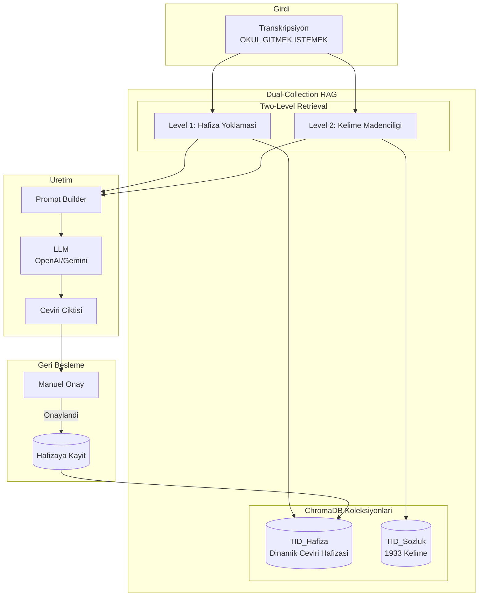

# TID Transkripsiyon RAG Sistemi

## Mimari Ozet



## Klasor Yapisi

```
TRANSKRIPSIYON-RAG-VDB/
├── config.py                 # Konfigürasyon (LLM, embedding model, paths)
├── requirements.txt          # Bagimliliklar
├── collections/
│   ├── __init__.py
│   ├── sozluk_collection.py  # TID_Sozluk yonetimi
│   └── hafiza_collection.py  # TID_Hafiza yonetimi
├── retriever/
│   ├── __init__.py
│   └── dual_retriever.py     # Iki asamali retrieval
├── prompt_builder/
│   ├── __init__.py
│   └── augmented_prompt.py   # RAG destekli prompt olusturma
├── feedback/
│   ├── __init__.py
│   └── feedback_handler.py   # Manuel onay ve hafiza guncelleme
├── scripts/
│   ├── init_sozluk.py        # TID_Sozluk koleksiyonunu olustur
│   ├── init_hafiza.py        # Bos TID_Hafiza olustur
│   └── test_rag.py           # Test scripti
├── vectorstore/              # ChromaDB persistent storage
│   └── .gitkeep
└── integration/
    ├── __init__.py
    └── anlamlandirma_adapter.py  # Mevcut sistem entegrasyonu
```

## Temel Bilesen Detaylari

### 1. Konfigürasyon ([TRANSKRIPSIYON-RAG-VDB/config.py](TRANSKRIPSIYON-RAG-VDB/config.py))

```python
# LLM Providers (configurable)
LLM_PROVIDERS = ["openai", "gemini"]
DEFAULT_LLM = "gemini"

# Embedding Model (Turkce destekli)
EMBEDDING_MODEL = "sentence-transformers/paraphrase-multilingual-MiniLM-L12-v2"

# ChromaDB paths
VECTORSTORE_PATH = "./vectorstore"
SOZLUK_COLLECTION = "tid_sozluk"
HAFIZA_COLLECTION = "tid_hafiza"

# TID_Sozluk_Verileri path
TID_SOZLUK_PATH = "../TID_Sozluk_Verileri"
```

### 2. TID_Sozluk Koleksiyonu (Statik)

- **Kaynak:** [TID_Sozluk_Verileri/](TID_Sozluk_Verileri/) klasorundeki 1933 `data.json` dosyasi
- **Embedding:** Kelime adi (ornegin: "Agac")
- **Metadata:** 
  - `kelime`: Ana kelime
  - `tur`: Kelime turu (Ad, Eylem, Sifat vb.)
  - `aciklama`: Anlam aciklamasi
  - `ornek_transkripsiyon`: Ornek TID cumlesi
  - `ornek_ceviri`: Ornek Turkce ceviri

### 3. TID_Hafiza Koleksiyonu (Dinamik)

- **Embedding:** Tam transkripsiyon cumlesi
- **Metadata:**
  - `transkripsiyon`: Ham TID transkripsiyonu
  - `ceviri`: Onaylanmis Turkce ceviri
  - `provider`: Kullanilan LLM
  - `onay_tarihi`: Onay timestamp'i

### 4. Two-Level Retrieval Akisi

```python
def rag_sorgusu_hazirla(transkripsiyon: str) -> dict:
    # Level 1: Hafiza yoklamasi (benzer cumleler)
    benzer_cumleler = hafiza_collection.query(
        query_texts=[transkripsiyon],
        n_results=3
    )
    
    # Level 2: Kelime madenciligi
    kelimeler = transkripsiyon.split()
    kelime_bilgileri = []
    for kelime in kelimeler:
        sonuc = sozluk_collection.query(
            query_texts=[kelime],
            n_results=1
        )
        kelime_bilgileri.append(sonuc)
    
    return {
        "referans_ceviriler": benzer_cumleler,
        "kelime_detaylari": kelime_bilgileri
    }
```

### 5. Entegrasyon Noktasi

Mevcut [anlamlandirma-sistemi/preprocessor.py](anlamlandirma-sistemi/preprocessor.py) dosyasindaki `create_final_prompt` fonksiyonu yeni RAG sistemini kullanacak sekilde guncellenecek.

### 6. Geri Besleme API'si

Yeni endpoint: `POST /api/approve_translation`

```python
{
    "transkripsiyon": "OKUL GITMEK ISTEMEK",
    "ceviri": "Okula gitmek istiyorum.",
    "provider": "gemini"
}
```

## Bagimliliklar

```
chromadb>=0.4.0
sentence-transformers>=2.2.0
openai>=1.0.0
google-generativeai>=0.3.0
```

## Basari Kriterleri

1. TID_Sozluk koleksiyonunda 1933 kelime vektorize edilmis
2. Transkripsiyon sorgusunda hem hafiza hem sozluk bilgisi cekilebiliyor
3. LLM promptu dinamik RAG baglami ile zenginlestiriliyor
4. Manuel onay ile ceviri hafizaya kaydedilebiliyor
5. Mevcut anlamlandirma-sistemi sorunsuz calisabiliyor