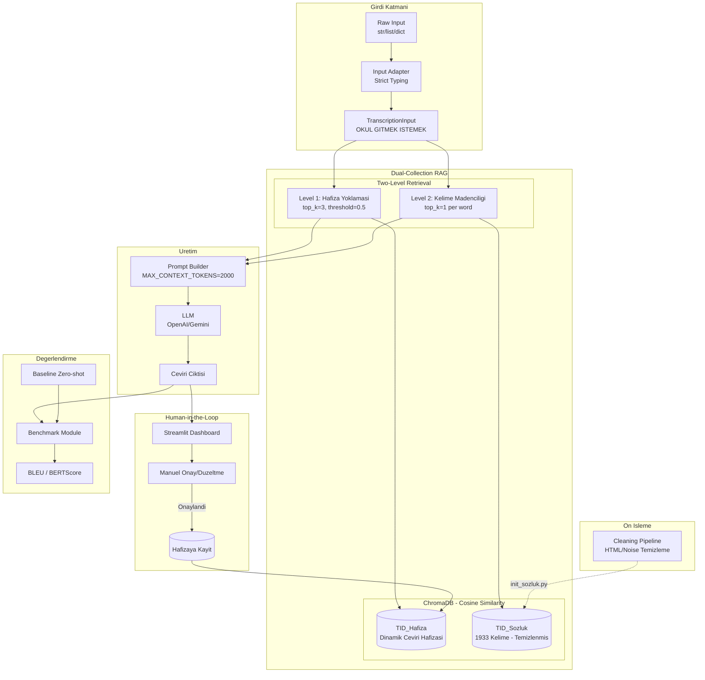

# TID Transkripsiyon RAG Sistemi

## Mimari Ozet



## Klasor Yapisi

```
TRANSKRIPSIYON-RAG-VDB/
├── config.py                 # Konfigürasyon (hyperparameter justification dahil)
├── requirements.txt          # Bagimliliklar
├── app.py                    # Streamlit Human-in-the-Loop Dashboard
├── preprocessing/
│   ├── __init__.py
│   └── cleaning.py           # Veri temizleme ve normalizasyon
├── collections/
│   ├── __init__.py
│   ├── sozluk_collection.py  # TID_Sozluk yonetimi
│   └── hafiza_collection.py  # TID_Hafiza yonetimi
├── retriever/
│   ├── __init__.py
│   └── dual_retriever.py     # Iki asamali retrieval
├── prompt_builder/
│   ├── __init__.py
│   └── augmented_prompt.py   # RAG destekli prompt olusturma
├── feedback/
│   ├── __init__.py
│   └── feedback_handler.py   # Manuel onay ve hafiza guncelleme
├── evaluation/
│   ├── __init__.py
│   ├── benchmark.py          # BLEU/BERTScore hesaplama
│   ├── baseline.py           # Zero-shot baseline karsilastirma
│   └── test_sets/            # Gold standard test cumleler
│       └── test_glosses.json
├── integration/
│   ├── __init__.py
│   ├── input_adapter.py      # Strict typed input handler
│   └── anlamlandirma_adapter.py  # Mevcut sistem entegrasyonu
├── scripts/
│   ├── init_sozluk.py        # TID_Sozluk koleksiyonunu olustur
│   ├── init_hafiza.py        # Bos TID_Hafiza olustur
│   ├── run_benchmark.py      # Benchmark calistirma scripti
│   └── test_rag.py           # Test scripti
└── vectorstore/              # ChromaDB persistent storage
    └── .gitkeep
```

## Temel Bilesen Detaylari

### 1. Konfigürasyon ve Hyperparameter Justification ([config.py](TRANSKRIPSIYON-RAG-VDB/config.py))

```python
# =============================================================================
# LLM CONFIGURATION
# =============================================================================
LLM_PROVIDERS = ["openai", "gemini"]
DEFAULT_LLM = "gemini"

# =============================================================================
# EMBEDDING MODEL
# Justification: paraphrase-multilingual-MiniLM-L12-v2 secildi cunku:
# 1. 50+ dil destekliyor (Turkce dahil)
# 2. Sentence-level semantic similarity icin optimize edilmis
# 3. 384 boyutlu vektor - hiz/kalite dengesi
# Alternatifler: multilingual-e5-large (daha iyi ama yavas)
# =============================================================================
EMBEDDING_MODEL = "sentence-transformers/paraphrase-multilingual-MiniLM-L12-v2"
EMBEDDING_DIMENSION = 384

# =============================================================================
# DISTANCE METRIC
# Justification: Cosine similarity secildi cunku:
# 1. Vektor yonelimini olcer (semantik benzerlik icin uygun)
# 2. Vektor buyuklugunden bagimsiz - normalize edilmis karsilastirma
# 3. NLP/embedding alaninda standart metrik
# Alternatif: L2 (Euclidean) - mutlak mesafe icin, bu use-case icin uygun degil
# =============================================================================
DISTANCE_METRIC = "cosine"  # ChromaDB: "cosine", "l2", "ip" destekler

# =============================================================================
# RETRIEVAL PARAMETERS
# Justification:
# - HAFIZA_TOP_K=3: Few-shot learning icin 2-3 ornek optimal (cok fazla noise yaratir)
# - SOZLUK_TOP_K=1: Her kelime icin en yakin eslesen yeterli
# - SIMILARITY_THRESHOLD=0.5: Dusuk benzerlikli sonuclari filtrele
# =============================================================================
HAFIZA_TOP_K = 3
SOZLUK_TOP_K = 1
SIMILARITY_THRESHOLD = 0.5

# =============================================================================
# CONTEXT WINDOW LIMITS
# Justification: LLM token limitleri ve prompt kalitesi dengesi
# - GPT-4o: 128K context, ama uzun promptlar dikkat dagilmasina neden olur
# - Gemini: 1M context, ayni sorun
# - MAX_CONTEXT_TOKENS: 2000 token = ~500 kelime, yeterli baglamsal bilgi
# =============================================================================
MAX_CONTEXT_TOKENS = 2000
MAX_DEFINITIONS_PER_WORD = 2  # Bir kelimenin en fazla 2 anlami prompt'a eklenir

# =============================================================================
# PATHS
# =============================================================================
VECTORSTORE_PATH = "./vectorstore"
SOZLUK_COLLECTION = "tid_sozluk"
HAFIZA_COLLECTION = "tid_hafiza"
TID_SOZLUK_PATH = "../TID_Sozluk_Verileri"

# =============================================================================
# BENCHMARK CONFIGURATION
# =============================================================================
BENCHMARK_TEST_SET = "./evaluation/test_sets/test_glosses.json"
ENABLE_BASELINE_COMPARISON = True  # RAG vs Zero-shot karsilastirmasi
```

### 2. Data Preprocessing Pipeline ([preprocessing/cleaning.py](TRANSKRIPSIYON-RAG-VDB/preprocessing/cleaning.py))

Web scraping'den gelen `data.json` verileri noise icerebilir. Temizleme adimlari:

```python
def clean_sozluk_entry(data: dict) -> dict:
    """TID_Sozluk_Verileri'nden gelen data.json'u temizler."""
  
    # 1. HTML artifact temizleme
    aciklama = remove_html_tags(data.get("aciklama", ""))
  
    # 2. Header/footer noise temizleme
    # "Guncel Turk Isaret Dili Sozlugu\nSozluk Kullanimi\n..." gibi tekrar eden metinler
    aciklama = remove_boilerplate(aciklama)
  
    # 3. Whitespace normalizasyonu
    aciklama = normalize_whitespace(aciklama)
  
    # 4. Transkripsiyon normalizasyonu (UPPERCASE, ozel karakterler)
    transkripsiyon = normalize_gloss(data.get("ornek", {}).get("transkripsiyon", ""))
  
    return {
        "kelime": data.get("kelime", "").strip(),
        "tur": extract_word_type(aciklama),  # "Ad", "Eylem", "Sifat" vb.
        "aciklama": aciklama,
        "transkripsiyon": transkripsiyon,
        "ceviri": data.get("ornek", {}).get("ceviri", "").strip()
    }

def normalize_gloss(gloss: str) -> str:
    """Transkripsiyon standardizasyonu."""
    # 1. Uppercase donusumu
    gloss = gloss.upper()
    # 2. "Ceviri:" sonrasi metni kaldir
    gloss = gloss.split("CEViRi:")[0].strip()
    # 3. Ozel karakterleri isle (^ -> bilesik kelime)
    return gloss
```

### 3. TID_Sozluk Koleksiyonu (Statik)

- **Kaynak:** [TID_Sozluk_Verileri/](TID_Sozluk_Verileri/) klasorundeki 1933 `data.json` dosyasi
- **Preprocessing:** `cleaning.py` ile temizlendikten sonra yuklenir
- **Embedding:** Kelime adi (ornegin: "Agac")
- **Metadata:**
  - `kelime`: Ana kelime
  - `tur`: Kelime turu (Ad, Eylem, Sifat vb.)
  - `aciklama`: Temizlenmis anlam aciklamasi
  - `ornek_transkripsiyon`: Normalize edilmis TID cumlesi
  - `ornek_ceviri`: Ornek Turkce ceviri

### 3. TID_Hafiza Koleksiyonu (Dinamik)

- **Embedding:** Tam transkripsiyon cumlesi
- **Metadata:**
  - `transkripsiyon`: Ham TID transkripsiyonu
  - `ceviri`: Onaylanmis Turkce ceviri
  - `provider`: Kullanilan LLM
  - `onay_tarihi`: Onay timestamp'i

### 4. Two-Level Retrieval Akisi

```python
def rag_sorgusu_hazirla(transkripsiyon: str) -> dict:
    # Level 1: Hafiza yoklamasi (benzer cumleler)
    benzer_cumleler = hafiza_collection.query(
        query_texts=[transkripsiyon],
        n_results=3
    )
  
    # Level 2: Kelime madenciligi
    kelimeler = transkripsiyon.split()
    kelime_bilgileri = []
    for kelime in kelimeler:
        sonuc = sozluk_collection.query(
            query_texts=[kelime],
            n_results=1
        )
        kelime_bilgileri.append(sonuc)
  
    return {
        "referans_ceviriler": benzer_cumleler,
        "kelime_detaylari": kelime_bilgileri
    }
```

### 6. Input Adapter - Strict Typing ([integration/input_adapter.py](TRANSKRIPSIYON-RAG-VDB/integration/input_adapter.py))

Upstream model farkli formatlarda cikti uretebilir. Adapter tum formatlari standartlastirir:

```python
from typing import Union, List
from dataclasses import dataclass

@dataclass
class TranscriptionInput:
    """Standardize edilmis transkripsiyon girdisi."""
    glosses: List[str]  # ['OKUL', 'GITMEK', 'ISTEMEK']
    raw_string: str     # "OKUL GITMEK ISTEMEK"
    confidence: float   # Model confidence (0-1)

def adapt_input(raw_input: Union[str, List[str], dict]) -> TranscriptionInput:
    """
    Farkli girdi formatlarini standart TranscriptionInput'a donusturur.
  
    Desteklenen formatlar:
  - str: "OKUL GITMEK ISTEMEK"
  - List[str]: ['OKUL', 'GITMEK', 'ISTEMEK']
  - dict: {'glosses': [...], 'confidence': 0.85}
    """
    if isinstance(raw_input, str):
        glosses = raw_input.upper().split()
        return TranscriptionInput(glosses=glosses, raw_string=raw_input.upper(), confidence=1.0)
  
    elif isinstance(raw_input, list):
        glosses = [g.upper() for g in raw_input]
        return TranscriptionInput(glosses=glosses, raw_string=" ".join(glosses), confidence=1.0)
  
    elif isinstance(raw_input, dict):
        glosses = [g.upper() for g in raw_input.get('glosses', [])]
        return TranscriptionInput(
            glosses=glosses,
            raw_string=" ".join(glosses),
            confidence=raw_input.get('confidence', 1.0)
        )
  
    raise TypeError(f"Desteklenmeyen girdi tipi: {type(raw_input)}")
```

### 7. Evaluation Framework ([evaluation/benchmark.py](TRANSKRIPSIYON-RAG-VDB/evaluation/benchmark.py))

Akademik tez icin kantitatif metrikler:

```python
from sacrebleu.metrics import BLEU
from bert_score import score as bert_score
from typing import List, Dict

class TranslationBenchmark:
    """RAG vs Baseline karsilastirmasi icin benchmark modulu."""
  
    def __init__(self, rag_system, llm_client):
        self.rag_system = rag_system
        self.llm_client = llm_client
        self.bleu = BLEU()
  
    def run_benchmark(self, test_set: List[Dict]) -> Dict:
        """
        Test seti uzerinde RAG ve Baseline karsilastirmasi yapar.
      
        test_set format:
        [{"gloss": "OKUL GITMEK ISTEMEK", "reference": "Okula gitmek istiyorum."}, ...]
        """
        rag_translations = []
        baseline_translations = []
        references = []
      
        for item in test_set:
            # RAG-Augmented translation
            rag_result = self.rag_system.translate(item["gloss"])
            rag_translations.append(rag_result)
          
            # Zero-shot Baseline (RAG olmadan)
            baseline_result = self.llm_client.translate_raw(item["gloss"])
            baseline_translations.append(baseline_result)
          
            references.append(item["reference"])
      
        return {
            "rag": self._calculate_metrics(rag_translations, references),
            "baseline": self._calculate_metrics(baseline_translations, references),
        }
  
    def _calculate_metrics(self, hypotheses: List[str], references: List[str]) -> Dict:
        # BLEU Score
        bleu_score = self.bleu.corpus_score(hypotheses, [references])
      
        # BERTScore (semantic similarity)
        P, R, F1 = bert_score(hypotheses, references, lang="tr", verbose=False)
      
        return {
            "bleu": bleu_score.score,
            "bertscore_precision": P.mean().item(),
            "bertscore_recall": R.mean().item(),
            "bertscore_f1": F1.mean().item(),
        }
```

### 8. Streamlit Human-in-the-Loop Dashboard ([app.py](TRANSKRIPSIYON-RAG-VDB/app.py))

Tez savunmasinda "iterative learning" gostermek icin gorsel arayuz:

```python
import streamlit as st

def main():
    st.title("TID RAG Translation System")
    st.subheader("Human-in-the-Loop Feedback Interface")
  
    # --- INPUT SECTION ---
    gloss_input = st.text_input("Transkripsiyon (Gloss):", "OKUL GITMEK ISTEMEK")
  
    if st.button("Cevir"):
        # --- RETRIEVAL VISUALIZATION ---
        st.subheader("1. Retrieved Context")
      
        col1, col2 = st.columns(2)
        with col1:
            st.markdown("**Hafiza (Benzer Cumleler):**")
            # Display similar sentences from TID_Hafiza
            st.json(retrieved_memory)
      
        with col2:
            st.markdown("**Sozluk (Kelime Bilgileri):**")
            # Display word definitions from TID_Sozluk
            st.json(retrieved_dictionary)
      
        # --- GENERATION ---
        st.subheader("2. Generated Translation")
        st.success(f"Ceviri: {translation}")
        st.info(f"Guven: {confidence}/10")
        st.text(f"Aciklama: {explanation}")
      
        # --- FEEDBACK LOOP ---
        st.subheader("3. Feedback (Duzeltme)")
        corrected = st.text_input("Duzeltilmis Ceviri:", translation)
      
        if st.button("Hafizaya Kaydet"):
            # Save to TID_Hafiza collection
            save_to_memory(gloss_input, corrected)
            st.success("Ceviri hafizaya kaydedildi! Sistem ogrenmeye devam ediyor.")
  
    # --- STATISTICS ---
    st.sidebar.subheader("Sistem Istatistikleri")
    st.sidebar.metric("Sozluk Kayit Sayisi", "1933")
    st.sidebar.metric("Hafiza Kayit Sayisi", memory_count)
```

### 9. Entegrasyon Noktasi

Mevcut [anlamlandirma-sistemi/preprocessor.py](anlamlandirma-sistemi/preprocessor.py) dosyasindaki `create_final_prompt` fonksiyonu yeni RAG sistemini kullanacak sekilde guncellenecek.

### 10. Geri Besleme API'si

Yeni endpoint: `POST /api/approve_translation`

```python
{
    "transkripsiyon": "OKUL GITMEK ISTEMEK",
    "ceviri": "Okula gitmek istiyorum.",
    "provider": "gemini"
}
```

## Bagimliliklar

```
# Core RAG
chromadb>=0.4.0
sentence-transformers>=2.2.0

# LLM Providers
openai>=1.0.0
google-generativeai>=0.3.0

# Evaluation (Academic Metrics)
sacrebleu>=2.3.0
bert-score>=0.3.13

# Dashboard
streamlit>=1.28.0

# Data Processing
regex>=2023.0.0
```

## Basari Kriterleri

### Teknik Basari Kriterleri

1. TID_Sozluk koleksiyonunda 1933 kelime temizlenmis ve vektorize edilmis
2. Transkripsiyon sorgusunda hem hafiza hem sozluk bilgisi cekilebiliyor
3. LLM promptu dinamik RAG baglami ile zenginlestiriliyor (MAX_CONTEXT_TOKENS limiti dahilinde)
4. Manuel onay ile ceviri hafizaya kaydedilebiliyor
5. Mevcut anlamlandirma-sistemi sorunsuz calisabiliyor

### Akademik Basari Kriterleri (Tez Savunmasi)

6. Benchmark modulu calisir durumda - BLEU ve BERTScore hesaplanabiliyor
7. Baseline vs RAG karsilastirmasi yapilabiliyor (ENABLE_BASELINE_COMPARISON=True)
8. Streamlit dashboard uzerinden Human-in-the-Loop sureci gosterilebiliyor
9. Hyperparameter secimleri config.py'de dokumante edilmis (Distance Metric, Context Limits)
10. Test seti (test_glosses.json) en az 50 ornek iceriyor

## Akademik Referans Notlari

Bu mimari asagidaki literaturdeki yaklasimlardan esinlenmistir:

- **Retrieval-Augmented Generation (RAG):** Lewis et al., 2020 - "Retrieval-Augmented Generation for Knowledge-Intensive NLP Tasks"
- **Translation Memory:** Somers, 2003 - "Translation Memory Systems"
- **Human-in-the-Loop ML:** Monarch, 2021 - "Human-in-the-Loop Machine Learning"

Tez basliginda kullanilabilecek terminoloji:

> "Iterative Dictionary-Augmented Generation with Feedback Loop for Turkish Sign Language Translation"
>
