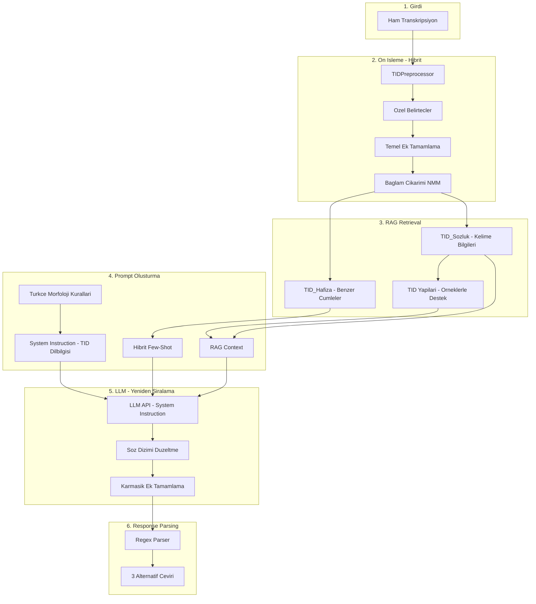

# TID Prompt Pipeline - Dilbilgisi Odakli

## Pipeline Genel Akisi



## 1. TID Dilbilgisi Kurallari (System Instruction)

### 1.1 Temel TID Ozellikleri

**Soz Dizimi (Topic-Comment vs SOV):**

- TID: Topic-Comment yapisi baskin - onemli oge one alinir
- Turkce: Ozne-Nesne-Yuklem (SOV)
- LLM'in gorevi: TID sirasini Turkce SOV'a cevirme

**Kurallar (system_instructions.py):**

```
## SOZ DIZIMI KURALLARI
- TID Topic-Comment yapisini Turkce SOV'a cevir
- Ornek: "ARABA BEN SATIN ALMAK" -> "Ben araba satin aldim" (SOV)
- Ornek: "YARIN TOPLANTI VAR" -> "Yarin toplanti var" (Zaman zarfi basta kalabilir)
```

### 1.2 El Disi Isaretler (NMM) - Baglamsal Cikarim

Gorsel model NMM'leri (yuz mimikleri, bas hareketleri) yakalamiyor. LLM baglamdan cikarim yapmali:

**Soru Cikarimi:**

```
## SORU CIKARIMI (NMM YOK)
Baglamdan soru anlami cikar:
- "NEREDE", "NE", "KIM", "NASIL", "NEDEN" varsa -> soru cumle
- "VAR" + baglam belirsizse -> "... var mi?" olabilir
- Ornek: "SEN YARIN GELMEK" + belirsiz baglam -> "Yarin gelecek misin?"
```

**Olumsuzluk Cikarimi:**

```
## OLUMSUZLUK CIKARIMI (NMM YOK)
- "DEGIL", "YOK" acikca varsa -> olumsuz
- Baglamda zitlik varsa -> olumsuz olabilir
- Ornek: "BEN ISTEMEK DEGIL" -> "Istemiyorum"
- Ornek: "PARA YOK" -> "Para yok" veya "Param yok"
```

### 1.3 Zaman ve Kip Cikarimi

**Zaman Belirtecleri:**

```
## ZAMAN KURALLARI
Acik zaman zarflari:
- DUN, GECEN (hafta/ay/yil) -> gecmis zaman (-di, -mis)
- BUGUN, SIMDI -> simdiki/genis zaman (-iyor, -ir)
- YARIN, GELECEK (hafta/ay/yil) -> gelecek zaman (-ecek)

Ozel belirtecler:
- BITMEK, TAMAM (cumle sonunda) -> eylem tamamlandi, gecmis zaman
- Ornek: "YEMEK YEMEK BITMEK" -> "Yemegi yedim" (tamamlanmis)
```

**Belirsiz Zaman:**

```
## BELIRSIZ ZAMAN
Zaman zarfi veya belirtec yoksa:
- Varsayilan: simdiki/genis zaman
- Baglamdan cikar (eger mumkunse)
- Alternatiflerde farkli zamanlar sun
```

## 2. Turkce Morfoloji Kurallari

### 2.1 Hibrit Ek Tamamlama

**Preprocessing'de Otomatik Eklenen:**

- Iyelik ekleri: BEN + ARABA -> "arabam" (context'e gore)
- Hal ekleri: OKUL + GITMEK -> "okula" (-e yonelme)
- Cogu: Preprocessing'de flag olarak isaretlenir, LLM uygular

**LLM'in Tamamladigi Karmasik Yapilar:**

- Bilesik zamanlar: "Gidiyordum", "Gelecektim"
- Edilgen cati: YAPMAK + baglam -> "yapildi"
- Ettirgen cati: GITMEK + baglam -> "goturdu"

### 2.2 Turkce Ses Uyumu Kurallari

```
## TURKCE SES UYUMU (LLM ICIN HATIRLATMA)
Buyuk Unlu Uyumu:
- Kalin unluden sonra kalin (a,i,o,u): kitap-lar, okul-dan
- Ince unluden sonra ince (e,i,o,u): ev-ler, gel-din

Kucuk Unlu Uyumu:
- Duz unluden sonra duz: gel-di, sev-di
- Yuvarlak unluden sonra duz/yuvarlak: gul-du, gor-du
```

## 3. TID'e Ozgu Yapilar - RAG Destekli

### 3.1 Pekistirme (Tekrar)

**Preprocessing:**

```python
# GEZMEK GEZMEK -> {"word": "GEZMEK", "marker": "_TEKRAR_"}
```

**System Instruction:**

```
## PEKISTIRME (TEKRAR)
_TEKRAR_ belirteci gordugunde:
- Sureklilik: "bol bol", "durmadan", "surekli"
- Yogunluk: "cok", "bir suru"
- Ornek: GEZMEK_TEKRAR -> "bol bol gezdik" veya "cok gezdik"
```

**RAG Destegi:**

- TID_Sozluk'te tekrar iceren ornekleri getir
- Benzer yapiyi goster

### 3.2 Bilesik Kelimeler

**Preprocessing:**

```python
# ARABA^SURMEK -> "ARABA_SURMEK" (bilesik kelime)
```

**System Instruction:**

```
## BILESIK KELIMELER
KELIME1_KELIME2 formatinda -> tek kavram olarak isle
- ARABA_SURMEK -> "araba kullanmak"
- YEMEK_YAPMAK -> "yemek pisirmek"
- RAG'dan gelen eslestirmeleri kullan
```

### 3.3 Uzamsal Referanslar (Locus)

```
## UZAMSAL REFERANSLAR
TID'de zamir ve yer gostermek icin uzamsal isaretler kullanilir:
- BEN, SEN, O -> kisi zamirleri
- BURASI, SURASI, ORASI -> yer zamirleri
- Baglamdan belirsizse "o/bu/su" kullan
```

## 4. Guncellenmis System Instruction

```python
TID_SYSTEM_INSTRUCTION = """
Sen 20 yillik deneyime sahip uzman bir Turk Isaret Dili (TID) tercumanisin.

## 1. TID SOZDIZIMI
- TID Topic-Comment yapisini kullanir (onemli oge once gelir)
- Turkce SOV (Ozne-Nesne-Yuklem) yapisina cevir
- Ornek: "ARABA BEN ALMAK" -> "Ben araba aldim"

## 2. EL DISI ISARETLER (NMM) - BAGLAMSAL CIKARIM
Gorsel model NMM'leri yakalayamaz. BAGLAMDAN CIKARIM YAP:

### Soru Cikarimi:
- "NEREDE", "NE", "KIM", "NASIL", "NEDEN" -> soru cumlesi
- Belirsiz baglam + kisi zamiri -> soru olabilir

### Olumsuzluk Cikarimi:
- "DEGIL", "YOK" -> acik olumsuzluk
- Baglamsal zitlik -> muhtemel olumsuzluk

## 3. ZAMAN KURALLARI
Acik Zaman Zarflari:
- DUN, GECEN -> gecmis (-di, -mis)
- BUGUN, SIMDI -> simdiki (-iyor) veya genis (-ir)
- YARIN, GELECEK -> gelecek (-ecek)

Ozel Belirtecler:
- _GECMIS_ZAMAN_ (BITMEK/TAMAM) -> eylem tamamlandi
- _TEKRAR_ -> sureklilik/yogunluk ("bol bol", "cok")
- _NEGASYON_ (DEGIL/YOK) -> olumsuz cumle

Belirsiz Zaman: Varsayilan simdiki/genis, alternatiflerde varyasyon sun

## 4. TURKCE MORFOLOJI
- Iyelik ekleri: BEN + ARABA -> "arabam"
- Hal ekleri: OKUL + GITMEK -> "okula gitmek"
- Unlu uyumu kurallarini uygula

## 5. TID'E OZGU YAPILAR
- Pekistirme (_TEKRAR_): "bol bol", "durmadan", "cok"
- Bilesik Kelimeler (KELIME1_KELIME2): tek kavram
- Uzamsal Referanslar: baglamdan zamir cikar

## 6. CIKTI FORMATI
3 ALTERNATIF CEVIRI SUN:

## ALTERNATIF 1
Ceviri: [en dogal ceviri]
Guven: [1-10]/10
Aciklama: [neden bu tercih]

## ALTERNATIF 2
Ceviri: [alternatif yorum]
Guven: [1-10]/10
Aciklama: [farklilik nedeni]

## ALTERNATIF 3
Ceviri: [baska bir olaslik]
Guven: [1-10]/10
Aciklama: [kullanim baglami]

## 7. ONEMLI UYARILAR
- Halusinasyon YAPMA: Transkripiyonda olmayan anlam ekleme
- Belirsizligi BELIRT: Emin degilsen aciklamada yaz
- RAG baglamini KULLAN: Sozluk ve hafiza bilgilerini dikkate al
"""
```

## 5. TIDPreprocessor Guncelleme

```python
class TIDPreprocessor:
    TENSE_MARKERS = {
        "DÜN": "past", "DÜNKÜ": "past", "GEÇEN": "past",
        "BUGÜN": "present", "ŞİMDİ": "present",
        "YARIN": "future", "GELECEK": "future",
    }
  
    COMPLETION_MARKERS = {"BİTMEK": "past", "TAMAM": "past", "OLDU": "past"}
    NEGATION_MARKERS = {"DEĞİL", "YOK", "HAYIR"}
    QUESTION_MARKERS = {"NEREDE", "NE", "KİM", "NASIL", "NEDEN", "KAÇTA", "HANGİ"}
  
    def preprocess(self, transcription: str) -> PreprocessedInput:
        words = transcription.upper().split()
      
        # 1. Tekrarlari tespit et
        words, repetitions = self._detect_repetitions(words)
      
        # 2. Bilesik kelimeleri isle
        words = self._handle_compounds(words)
      
        # 3. Zaman cikarimi
        tense, tense_source = self._detect_tense(words)
      
        # 4. Soru/Olumsuzluk belirtecleri
        is_question = self._detect_question(words)
        is_negative = self._detect_negation(words)
      
        # 5. Ozel belirtecleri degistir
        processed_words = self._replace_markers(words)
      
        return PreprocessedInput(
            original=transcription,
            processed=" ".join(processed_words),
            word_list=words,
            detected_tense=tense,
            tense_source=tense_source,  # "explicit" veya "inferred"
            is_question=is_question,
            is_negative=is_negative,
            repetitions=repetitions,  # {"GEZMEK": 2}
            linguistic_hints={
                "topic_first": self._detect_topic(words),
                "has_temporal": tense is not None,
            }
        )
  
    def _detect_repetitions(self, words: List[str]) -> Tuple[List[str], Dict]:
        """GEZMEK GEZMEK -> GEZMEK_TEKRAR, {"GEZMEK": 2}"""
        ...
  
    def _detect_topic(self, words: List[str]) -> Optional[str]:
        """Topic-Comment yapisinda topic'i tespit et"""
        # Ilk kelime genellikle topic (sozlukten tur kontrolu)
        ...
```

## 6. Few-Shot Builder - Dilbilgisi Odakli Ornekler

```python
class FewShotBuilder:
    # Dilbilgisi yapisina gore kategorize edilmis statik ornekler
    STATIC_EXAMPLES = {
        "topic_comment": [
            {"input": "ARABA BEN ALMAK DÜN", "output": "Dun araba aldim."},
        ],
        "tense_past": [
            {"input": "OKUL GITMEK BITMEK", "output": "Okula gittim."},
        ],
        "tense_future": [
            {"input": "YARIN TOPLANTI VAR", "output": "Yarin toplanti var."},
        ],
        "negation": [
            {"input": "BEN GITMEK DEGIL", "output": "Gitmiyorum."},
        ],
        "question_context": [
            {"input": "SEN NEREDE CALISMA", "output": "Nerede calisiyorsun?"},
        ],
        "repetition": [
            {"input": "YÜRÜMEK YÜRÜMEK YORULMAK", "output": "Cok yuruyup yoruldum."},
        ],
    }
  
    def build_examples(self, preprocessed: PreprocessedInput, hafiza_results: List) -> str:
        examples = []
      
        # 1. Tespit edilen dilbilgisi yapisina uygun statik ornek sec
        if preprocessed.is_question:
            examples.append(self._get_static("question_context"))
        if preprocessed.detected_tense == "past":
            examples.append(self._get_static("tense_past"))
        if preprocessed.repetitions:
            examples.append(self._get_static("repetition"))
      
        # 2. Hafiza'dan benzer yapisal ornekler (max 2)
        for result in hafiza_results[:2]:
            if result["similarity"] > 0.6:
                examples.append({
                    "input": result["transkripsiyon"],
                    "output": result["ceviri"]
                })
      
        # 3. Minimum 3, maksimum 5 ornek
        return self._format_examples(examples[:5])
```

## 7. RAG Context - TID Yapilari Eklentisi

`dual_retriever.py` guncelleme:

```python
def to_context_string(self) -> str:
    context_parts = []
  
    # 1. Benzer cumleler (Hafiza)
    if self.similar_translations:
        context_parts.append("## BENZER CEVIRI ORNEKLERI")
        for t in self.similar_translations[:3]:
            context_parts.append(f"- {t['transkripsiyon']} -> {t['ceviri']}")
  
    # 2. Kelime bilgileri (Sozluk)
    if self.word_definitions:
        context_parts.append("\n## KELIME BILGILERI")
        for word, info in self.word_definitions.items():
            if info:
                context_parts.append(f"- {word}: {info['aciklama']} ({info['tur']})")
                # Ornek cumle varsa ekle (TID yapisi gostermek icin)
                if info.get('ornek_transkripsiyon'):
                    context_parts.append(f"  Ornek: {info['ornek_transkripsiyon']} -> {info['ornek_ceviri']}")
  
    # 3. Bulunamayan kelimeler
    if self.not_found_words:
        context_parts.append(f"\n## SOZLUKTE BULUNMAYAN: {', '.join(self.not_found_words)}")
        context_parts.append("(Genel bilginle yorumla)")
  
    return "\n".join(context_parts)
```

## Dosya Yapisi (Guncellenmis)

```
TRANSKRIPSIYON-RAG-VDB/
├── preprocessing/
│   ├── cleaning.py
│   └── tid_preprocessor.py     # TID dilbilgisi on isleme
├── prompt_builder/
│   ├── augmented_prompt.py
│   ├── system_instructions.py  # Detayli TID/Turkce kurallari
│   ├── few_shot_builder.py     # Dilbilgisi odakli ornekler
│   └── templates.py
├── llm/
│   ├── llm_client.py           # System instruction destekli
│   └── response_parser.py
├── retriever/
│   └── dual_retriever.py       # TID yapilari eklentisi
└── pipeline/
    └── translation_pipeline.py
```

## Basari Kriterleri (Dilbilgisi Odakli)

1. TID Topic-Comment -> Turkce SOV donusumu calisyor
2. NMM yoklugunda baglamsal cikarim (soru/olumsuzluk) calisyor
3. Zaman cikarimi (acik zarf + ozel belirtec + varsayilan) dogru
4. Hibrit ek tamamlama: preprocessing flag + LLM uygulama
5. Pekistirme/tekrar dogru yorumlaniyor
6. Few-shot ornekler dilbilgisi yapisina gore seciliyor
7. RAG context TID yapilarini orneklerle destekliyor
8. 3 alternatif ceviri farkli yorumlar sunuyor
