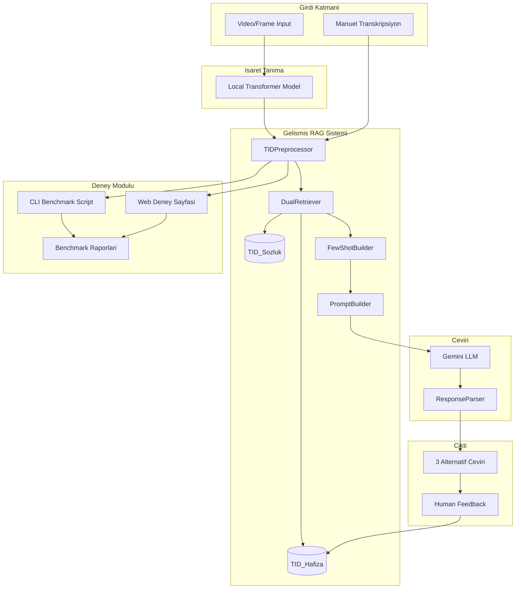

# Anlamlandirma Sistemi RAG Entegrasyonu ve Deney Modulu

## Mevcut Durum Analizi

### TRANSKRIPSIYON-RAG-VDB (Kaynak Sistem)

- Dual-collection RAG: TID_Sozluk (2867 kelime) + TID_Hafiza (2845 ceviri)
- Gelismis TID preprocessor (zaman, soru, olumsuzluk, tekrar tespiti)
- ChromaDB vektor veritabani
- 3 alternatif ceviri ureten prompt builder
- BLEU ve BERTScore degerlendirme
- Streamlit dashboard

### anlamlandirma-sistemi (Hedef Sistem)

- Flask web uygulamasi ([app.py](anlamlandirma-sistemi/app.py))
- Basit TF-IDF RAG ([rag_simple.py](anlamlandirma-sistemi/rag_simple.py))
- Temel regex preprocessor ([preprocessor.py](anlamlandirma-sistemi/preprocessor.py))
- Video isaret tanima modeli entegrasyonu

---

## Entegrasyon Mimarisi



---

## Kritik Riskler ve Cozumleri

### Risk 1: Import Path Sorunu (YUKSEK)

**Problem:** Kopyalanan modullerdeki `from preprocessing.tid_preprocessor import ...` gibi importlar calismayacak.

**Cozum:** Tum dosyalarda import path'lerini `from rag.preprocessing.tid_preprocessor import ...` seklinde guncelle.

### Risk 2: Config Path Sorunu (YUKSEK)

**Problem:** `TID_SOZLUK_PATH = BASE_DIR.parent / "TID_Sozluk_Verileri"` path'i yanlis olacak.

**Cozum:** Environment variable destegi ekle: `os.environ.get("TID_SOZLUK_PATH", default_path)`

### Risk 3: ChromaDB Baslangic (ORTA)

**Problem:** Vectorstore bos veya bulunamiyor olabilir.

**Cozum:** Mevcut vectorstore'u kopyala + app.py'de startup kontrolu ekle.

### Risk 4: UI Tek Ceviri (ORTA)

**Problem:** demo.html sadece tek ceviri gosteriyor.

**Cozum:** Template'i 3 alternatif gosterecek sekilde guncelle.

### Risk 5: Fallback Eksik (ORTA)

**Problem:** RAG basarisiz olursa sistem duruyor.

**Cozum:** try-except ile basit TF-IDF fallback mekanizmasi.

---

## Uygulama Adimlari

### Adim 0: Yedekleme (YENi)

```bash
cd anlamlandirma-sistemi
cp preprocessor.py preprocessor.py.bak
cp rag_simple.py rag_simple.py.bak
```

### Adim 1: RAG Modullerinin Kopyalanmasi

Asagidaki klasorler `anlamlandirma-sistemi/rag/` altina kopyalanacak:

- `config.py` - Yapilandirma (path'ler guncellenecek)
- `preprocessing/` - TID preprocessor + cleaning
- `tid_collections/` - ChromaDB koleksiyonlari
- `retriever/` - DualRetriever
- `prompt_builder/` - Few-shot ve template builder
- `llm/` - LLM client ve response parser
- `pipeline/` - TranslationPipeline orchestrator
- `feedback/` - Human-in-the-loop

**Not:** `evaluation/` klasoru ayri olarak `experiments/` altina kopyalanacak.

### Adim 1.5: Vectorstore Kopyalama (YENI)

```bash
cp -r TRANSKRIPSIYON-RAG-VDB/vectorstore anlamlandirma-sistemi/vectorstore
```

### Adim 2: Import Path Duzeltme (YENI)

Tum `rag/` altindaki dosyalarda asagidaki degisiklikler yapilacak:

```python
# ONCE:
from preprocessing.tid_preprocessor import TIDPreprocessor
from config import VECTORSTORE_PATH

# SONRA:
from rag.preprocessing.tid_preprocessor import TIDPreprocessor
from rag.config import VECTORSTORE_PATH
```

Etkilenen dosyalar (toplam ~15 dosya):

- `rag/tid_collections/sozluk_collection.py`
- `rag/tid_collections/hafiza_collection.py`
- `rag/retriever/dual_retriever.py`
- `rag/prompt_builder/*.py`
- `rag/llm/*.py`
- `rag/pipeline/translation_pipeline.py`
- `rag/feedback/feedback_handler.py`

### Adim 2.5: Config Esnekligi (YENI)

`rag/config.py` guncellemesi:

```python
import os
from pathlib import Path

BASE_DIR = Path(__file__).parent
PROJECT_ROOT = BASE_DIR.parent.parent  # sign-transcriber/

# Esnek path tanimlari
VECTORSTORE_PATH = Path(os.environ.get(
    "VECTORSTORE_PATH",
    str(BASE_DIR.parent / "vectorstore")
))

TID_SOZLUK_PATH = Path(os.environ.get(
    "TID_SOZLUK_PATH",
    str(PROJECT_ROOT / "TID_Sozluk_Verileri")
))
```

### Adim 3: Dosya Degisiklikleri

#### [preprocessor.py](anlamlandirma-sistemi/preprocessor.py) - Tamamen Yeniden Yazilacak

```python
# Yeni preprocessor.py - RAG entegrasyonu
from rag.pipeline import TranslationPipeline
from rag.preprocessing.tid_preprocessor import TIDPreprocessor

_pipeline = None

def get_pipeline():
    global _pipeline
    if _pipeline is None:
        _pipeline = TranslationPipeline(provider="gemini")
    return _pipeline

def preprocess_text_for_llm(transcription: str) -> str:
    preprocessor = TIDPreprocessor()
    result = preprocessor.preprocess(transcription)
    return result.processed

def create_final_prompt(processed_transcription: str) -> str:
    pipeline = get_pipeline()
    # RAG-augmented prompt olustur
    ...
```

#### [rag_simple.py](anlamlandirma-sistemi/rag_simple.py) - Fallback Olarak Korunacak

```python
# rag_simple.py - FALLBACK olarak tutulacak
# RAG sistemi basarisiz olursa bu kullanilacak
```

#### [llm_services.py](anlamlandirma-sistemi/llm_services.py) - ResponseParser ve 3 Alternatif Destegi

```python
def parse_structured_output(llm_response: str) -> dict:
    """LLM'den gelen 3 alternatifli ciktiyi ayristirir."""
    # Yeni: 3 alternatif parse
    alternatives = []
    for i in range(1, 4):
        alt_match = re.search(
            rf"## ALTERNATIF {i}.*?Ceviri:\s*(.*?)\n.*?Guven:\s*(\d+)",
            llm_response, re.DOTALL | re.IGNORECASE
        )
        if alt_match:
            alternatives.append({
                "translation": alt_match.group(1).strip(),
                "confidence": int(alt_match.group(2)),
            })
  
    if alternatives:
        best = max(alternatives, key=lambda x: x["confidence"])
        return {
            "translation": best["translation"],
            "confidence": best["confidence"],
            "alternatives": alternatives,  # YENi
            "error": None,
        }
    # Fallback to old parser...
```

### Adim 3.5: demo.html 3 Alternatif Guncelleme (YENI)

`templates/demo.html` - Ceviri sonuclari bolumu:

```html
<!-- 3 Alternatif Ceviri Gosterimi -->

<div class="alternatives-section mt-3">
    <h6 class="text-secondary">Alternatif Ceviriler:</h6>
    
    <div class="card mb-2 border-primary">
        <div class="card-body py-2">
            <div class="d-flex justify-content-between">
                <span>{{ alt.translation }}</span>
                <span class="badge bg-{{ 'success' if alt.confidence >= 8 else 'warning' }}">
                    {{ alt.confidence }}/10
                </span>
            </div>
        </div>
    </div>
    
</div>

```

### Adim 3.6: Fallback Mekanizmasi (YENI)

`preprocessor.py` icinde fallback:

```python
# Yeni preprocessor.py
_pipeline = None
_fallback_mode = False

def get_pipeline():
    global _pipeline, _fallback_mode
    if _pipeline is None:
        try:
            from rag.pipeline.translation_pipeline import TranslationPipeline
            _pipeline = TranslationPipeline(provider="gemini")
        except Exception as e:
            print(f"RAG sistemi baslatilamadi: {e}")
            print("Fallback TF-IDF moduna geciliyor...")
            _fallback_mode = True
    return _pipeline

def create_final_prompt(processed_transcription: str) -> str:
    if _fallback_mode:
        # Eski basit prompt (rag_simple.py'den)
        from rag_simple_backup import get_retrieved_context
        # ... fallback logic
    else:
        pipeline = get_pipeline()
        # ... RAG logic
```

### Adim 4: Deney Modulu Olusturulmasi

#### CLI Script: `anlamlandirma-sistemi/experiments/run_experiments.py`

```python
# Kelime sayisina gore filtrelenmis test setleri
# 3-kelime, 4-kelime, 5-kelime deneyleri
# BLEU ve BERTScore metrikleri
# JSON/CSV rapor ciktisi
```

#### Web Arayuzu: `anlamlandirma-sistemi/templates/experiments.html`

- Kelime sayisi secimi (3/4/5)
- Toplu test calistirma
- Sonuc gorsellestirme
- Benchmark karsilastirma

### Adim 5: Test Seti Olusturulmasi

`anlamlandirma-sistemi/experiments/test_sets/` klasorunde:

#### 3_word_glosses.json (20 ornek)

Mevcut `test_glosses.json`'dan filtreleme:

- BEN OKUL GITMEK
- SEN YEMEK YEMEK
- BEN KITAP OKUMAK
- ANNE YEMEK PISIRMEK
- ... (toplam 20 adet)

#### 4_word_glosses.json (20 ornek)

Mevcut `test_glosses.json`'dan filtreleme:

- BEN CAY ICMEK ISTEMEK
- COCUK PARK OYNAMAK ISTEMEK
- ... (toplam 20 adet)

#### 5_word_glosses.json (20 ornek - MANUEL OLUSTURULACAK)

TID gramerine uygun 5 kelimelik ornekler:

```json
[
    {"gloss": "DUN BEN ARKADAS BULUSMAK KONUSMAK", "reference": "Dun arkadasimla bulustum ve konustuk."},
    {"gloss": "YARIN SEN OKUL SINAV OLMAK", "reference": "Yarin okulda sinavin var."},
    {"gloss": "ANNE MUTFAK YEMEK PISIRMEK BITMEK", "reference": "Annem mutfakta yemek pisirmeyi bitirdi."},
    {"gloss": "BEN ISTANBUL UCAK GITMEK ISTEMEK", "reference": "Istanbul'a ucakla gitmek istiyorum."},
    {"gloss": "COCUK PARK TOP OYNAMAK SEVMEK", "reference": "Cocuk parkta top oynamayi seviyor."},
    {"gloss": "BABA IS CALISMAK GEC GELMEK", "reference": "Babam isten gec geldi."},
    {"gloss": "BEN FILM IZLEMEK COK BEGENMEK", "reference": "Filmi izledim ve cok begendim."},
    {"gloss": "SEN KAHVALTI NE YEMEK ISTEMEK", "reference": "Kahvaltida ne yemek istiyorsun?"},
    {"gloss": "HAVA SOGUK OLMAK DIS GITMEK", "reference": "Hava soguk, disari cikma."},
    {"gloss": "BEN TURKCE OGRENMEK ZOR OLMAK", "reference": "Turkce ogrenmek zor."},
    {"gloss": "ARABA KIRMIZI OLMAK COK GUZEL", "reference": "Kirmizi araba cok guzel."},
    {"gloss": "DUN GECE YAGMUR YAGMAK COK", "reference": "Dun gece cok yagmur yagdi."},
    {"gloss": "BEN SPOR YAPMAK SAGLIKLI OLMAK", "reference": "Spor yapiyorum, saglikli oluyorum."},
    {"gloss": "SEN NEREDE CALISMA SORMAK ISTEMEK", "reference": "Nerede calistigini sormak istiyorum."},
    {"gloss": "OKUL YAKIN OLMAK YURUYEK GITMEK", "reference": "Okul yakin, yuruyerek gidiyorum."},
    {"gloss": "BEN MUZIK DINLEMEK MUTLU OLMAK", "reference": "Muzik dinliyorum, mutlu oluyorum."},
    {"gloss": "ANNE BABA EVDE OLMAK BEKLEMEK", "reference": "Anne babam evde beni bekliyor."},
    {"gloss": "BEN KITAP OKUMAK BITIRMEK ISTEMEK", "reference": "Kitabi okuyup bitirmek istiyorum."},
    {"gloss": "YARIN HAVA GUZEL OLMAK GEZMEK", "reference": "Yarin hava guzel olursa gezeriz."},
    {"gloss": "SEN TELEFON KONUSMAK KIM OLMAK", "reference": "Telefonda kiminle konusuyorsun?"}
]
```

### Adim 5: Benchmark ve Raporlama

- BLEU Score hesaplama
- BERTScore (Turkce) hesaplama
- Kelime sayisina gore performans karsilastirmasi
- Eski sistem vs Yeni RAG sistem karsilastirmasi
- Markdown ve JSON formatinda rapor ciktisi

### Adim 6: Dokumantasyon

- `anlamlandirma-sistemi/RAG_ENTEGRASYON.md` - Teknik dokumantasyon
- `anlamlandirma-sistemi/DENEY_KILAVUZU.md` - Deney calistirma kilavuzu
- Kod icinde detayli yorumlar

---

## Dosya Yapisi (Son Hali)

```
anlamlandirma-sistemi/
├── app.py                          # Flask app (guncellenmis - startup kontrolu)
├── preprocessor.py                 # RAG-tabanli (yeniden yazilmis)
├── preprocessor.py.bak             # Yedek (rollback icin)
├── rag_simple.py.bak               # Yedek (fallback icin)
├── llm_services.py                 # ResponseParser entegreli (3 alternatif)
├── rag/                            # Yeni RAG modulu
│   ├── __init__.py
│   ├── config.py                   # Esnek path yapilandirmasi
│   ├── preprocessing/
│   │   ├── __init__.py
│   │   ├── tid_preprocessor.py
│   │   └── cleaning.py
│   ├── tid_collections/
│   │   ├── __init__.py
│   │   ├── sozluk_collection.py
│   │   └── hafiza_collection.py
│   ├── retriever/
│   │   ├── __init__.py
│   │   └── dual_retriever.py
│   ├── prompt_builder/
│   │   ├── __init__.py
│   │   ├── system_instructions.py
│   │   ├── few_shot_builder.py
│   │   ├── templates.py
│   │   └── augmented_prompt.py
│   ├── llm/
│   │   ├── __init__.py
│   │   ├── llm_client.py
│   │   └── response_parser.py
│   ├── pipeline/
│   │   ├── __init__.py
│   │   └── translation_pipeline.py
│   └── feedback/
│       ├── __init__.py
│       └── feedback_handler.py
├── experiments/                    # Deney modulu
│   ├── __init__.py
│   ├── run_experiments.py          # CLI script
│   ├── experiment_runner.py        # Core deney logic
│   ├── report_generator.py         # Rapor olusturucu
│   └── test_sets/
│       ├── 3_word_glosses.json     # 20 ornek (filtrelenmis)
│       ├── 4_word_glosses.json     # 20 ornek (filtrelenmis)
│       └── 5_word_glosses.json     # 20 ornek (manuel)
├── vectorstore/                    # ChromaDB verileri (kopyalanmis)
│   ├── chroma.sqlite3
│   └── [collection folders]/
├── templates/
│   ├── demo.html                   # Guncellenmis (3 alternatif)
│   ├── experiments.html            # Yeni deney arayuzu
│   └── ...
├── RAG_ENTEGRASYON.md              # Teknik dokumantasyon
├── DENEY_KILAVUZU.md               # Kullanim kilavuzu
└── requirements.txt                # Guncellenmis bagimliliklar
```

---

## Rollback Plani

Entegrasyon basarisiz olursa:

```bash
# 1. Yedekleri geri yukle
cd anlamlandirma-sistemi
mv preprocessor.py.bak preprocessor.py
mv rag_simple.py.bak rag_simple.py

# 2. RAG klasorunu sil
rm -rf rag/

# 3. Vectorstore'u sil
rm -rf vectorstore/

# 4. Flask'i yeniden baslat
pkill -f "flask run"
python app.py
```

---

## Kritik Entegrasyon Noktalari

### 1. app.py Degisiklikleri

```python
# Startup kontrolu (YENi)
def check_rag_system():
    """RAG sisteminin hazir olup olmadigini kontrol et."""
    try:
        from rag.config import VECTORSTORE_PATH
        if not VECTORSTORE_PATH.exists():
            print("UYARI: Vectorstore bulunamadi!")
            return False
      
        from rag.tid_collections.sozluk_collection import SozlukCollection
        sozluk = SozlukCollection()
        count = sozluk.get_count()
        print(f"RAG sistemi hazir: {count} kelime yuklendi.")
        return count > 0
    except Exception as e:
        print(f"RAG sistemi hatasi: {e}")
        return False

# Flask app baslangicinda cagir
with app.app_context():
    RAG_READY = check_rag_system()

# Yeni endpoint
@app.route('/experiments', methods=['GET'])
def experiments_page():
    return render_template('experiments.html', rag_ready=RAG_READY)

@app.route('/api/run_experiment', methods=['POST'])
def run_experiment():
    word_count = request.json.get('word_count', 3)
    test_file = f"experiments/test_sets/{word_count}_word_glosses.json"
    # Deney calistir ve sonuclari dondur
  
@app.route('/api/rag_status', methods=['GET'])
def rag_status():
    """RAG sistem durumunu dondur."""
    return jsonify({
        'ready': RAG_READY,
        'vectorstore_path': str(VECTORSTORE_PATH) if RAG_READY else None,
    })
```

### 2. Video Model Entegrasyonu

Gercek zamanli model ciktilari icin `process_frame_sequence()` fonksiyonundan gelen transkripsiyon dogrudan yeni RAG pipeline'a yonlendirilecek.

```python
# app.py - process_frame_sequence guncelleme
def process_frame_sequence(frames):
    result = predict_from_frames(LOCAL_MODEL, frames, confidence_threshold=0.10)
    transcription = result.get('pred_name', '') if result.get('threshold_met') else ''
  
    # Yeni: RAG pipeline ile zenginlestir
    if transcription and RAG_READY:
        try:
            from preprocessor import get_pipeline
            pipeline = get_pipeline()
            if pipeline:
                # Sadece preprocessing yap, LLM cagirma
                preprocessed = pipeline.preprocessor.preprocess(transcription)
                transcription = preprocessed.processed
        except Exception:
            pass  # Fallback: ham transkripsiyon kullan
  
    return transcription
```

### 3. Requirements Guncellemesi

Eklenmesi gereken bagimliliklar:

```
# RAG Sistemi
chromadb>=0.4.0
sentence-transformers>=2.2.0

# Benchmark/Evaluation
sacrebleu>=2.3.0
bert-score>=0.3.13

# Not: sentence-transformers ilk calistirmada ~400MB model indirecek
# Offline ortamda calisacaksa model onceden indirilmeli
```

### 4. Cevresel Degiskenler

`.env` dosyasina eklenmesi gerekenler:

```bash
# LLM API Keys (en az biri gerekli)
GEMINI_API_KEY=your-key-here
GOOGLE_API_KEY=your-key-here  # Alternatif isim

# Opsiyonel: Path override
# TID_SOZLUK_PATH=/custom/path/to/TID_Sozluk_Verileri
# VECTORSTORE_PATH=/custom/path/to/vectorstore
```

---

## Beklenen Ciktilar

1. **Tam entegre RAG sistemi** - Fallback mekanizmasi ile
2. **3/4/5 kelimelik deney CLI scripti** - `python experiments/run_experiments.py --words 5`
3. **Web tabanli deney arayuzu** - `/experiments` endpoint
4. **Her kelime sayisi icin 20 orneklik test seti** - 3 ve 4 kelime filtrelenmis, 5 kelime manuel
5. **demo.html 3 alternatif gosterim** - En iyi + 2 alternatif ceviri
6. **Benchmark raporlari** - BLEU, BERTScore, kelime sayisina gore karsilastirma
7. **Teknik dokumantasyon** - RAG_ENTEGRASYON.md, DENEY_KILAVUZU.md
8. **Rollback yeterliligi** - .bak dosyalari ile geri alma imkani

---

## Uygulama Sirasi Ozeti

| Adim | Islem | Sure Tahmini |

|------|-------|--------------|

| 0 | Yedekleme | 1 dakika |

| 1 | RAG modullerini kopyala | 2 dakika |

| 1.5 | Vectorstore kopyala | 1 dakika |

| 2 | Import path'leri duzelt | 15 dakika |

| 2.5 | Config esnekligi | 5 dakika |

| 3 | preprocessor.py yeniden yaz | 10 dakika |

| 3.5 | demo.html guncelle | 10 dakika |

| 3.6 | Fallback mekanizmasi | 10 dakika |

| 4 | llm_services.py guncelle | 10 dakika |

| 5 | Test setleri olustur | 15 dakika |

| 6 | Deney CLI scripti | 20 dakika |

| 7 | Deney web arayuzu | 20 dakika |

| 8 | app.py guncellemeleri | 15 dakika |

| 9 | requirements.txt | 2 dakika |

| 10 | Dokumantasyon | 15 dakika |

| 11 | Test ve benchmark | 20 dakika |

**Toplam tahmini sure:** ~2.5 saat

---

## Makale Icin Kullanim Dokumani

Bu bolum, sistemin akademik bir makalede nasil sunulabilecegini ve hangi bilesenlerin hangi bolumlerde kullanilabilecegini aciklar.

### 1. Metodoloji Bolumu (Methodology)

#### 1.1 Sistem Mimarisi

**Kullanilacak diyagram:** Entegrasyon Mimarisi (mermaid flowchart)

**Aciklama metni:**

> Onerilen sistem, Turk Isaret Dili (TID) transkripsiyon dizilerini dogal Turkce cumlelere cevirmek icin Iterative Dictionary-Augmented Generation (IDAG) yaklasimini kullanmaktadir. Sistem, iki katmanli RAG (Retrieval-Augmented Generation) mimarisi uzerine insa edilmistir: (1) Statik Sozluk Koleksiyonu (TID_Sozluk) ve (2) Dinamik Ceviri Hafizasi (TID_Hafiza).

**Tablo: Sistem Bilesenleri**

| Bilesen | Teknoloji | Amac |

|---------|-----------|------|

| Vektor Veritabani | ChromaDB | Semantik arama |

| Embedding Model | paraphrase-multilingual-MiniLM-L12-v2 | Turkce destekli 384-boyutlu vektorlestirme |

| Mesafe Metrigi | Cosine Similarity | Semantik benzerlik olcumu |

| LLM | Google Gemini 2.0 Flash | Dogal dil uretimi |

| Preprocessing | TIDPreprocessor | TID dilbilgisi analizi |

#### 1.2 TID Dilbilgisi Modelleme

**Kullanilacak dosya:** `rag/preprocessing/tid_preprocessor.py`

**Makalede sunulacak ozellikler:**

| TID Ozelligi | Tespit Yontemi | Turkce Karsiligi |

|--------------|----------------|------------------|

| Topic-Comment yapisi | Kelime sirasi analizi | SOV donusumu |

| Zaman belirtecleri | Regex esleme (DUN, YARIN, BITMEK) | Fiil cekimi (-di, -ecek) |

| Soru yapilari | NEREDE, NE, KIM tespiti | Soru cumlesi olusturma |

| Olumsuzluk | DEGIL, YOK belirtecleri | Olumsuz fiil cekimi |

| Pekistirme | Kelime tekrari (GEZMEK GEZMEK) | Yogunluk ifadesi (bol bol) |

**Kod ornegi (makaleye eklenebilir):**

```python
# TID Zaman Belirteci Tespiti
TENSE_MARKERS = {
    "DUN": "past", "GECEN": "past",     # Gecmis zaman
    "BUGUN": "present", "SIMDI": "present",  # Simdiki zaman
    "YARIN": "future", "SONRA": "future",    # Gelecek zaman
}

# Eylem Tamamlanma Belirtecleri
COMPLETION_MARKERS = {"BITMEK": "past", "TAMAM": "past"}
```

#### 1.3 RAG Stratejisi

**Dual-Collection Yaklasimi:**

```
Girdi: TID Transkripsiyon
    |
    v
[Level 1: Hafiza Sorgusu] --> Benzer ceviri ornekleri (top_k=3)
    |
    v
[Level 2: Sozluk Sorgusu] --> Kelime bazli anlam bilgisi (top_k=1/kelime)
    |
    v
[Prompt Augmentation] --> Few-shot ornekler + RAG baglami
    |
    v
[LLM Generation] --> 3 alternatif ceviri
```

**Hyperparameter Justification (makale icin kritik):**

| Parametre | Deger | Gerekce |

|-----------|-------|---------|

| HAFIZA_TOP_K | 3 | Few-shot learning icin optimal; fazlasi noise yaratir |

| SOZLUK_TOP_K | 1 | Kelime basina tek anlam yeterli |

| SIMILARITY_THRESHOLD | 0.5 | Dusuk kaliteli eslesmeleri filtreler |

| EMBEDDING_DIM | 384 | Hiz/kalite dengesi; 768 gereksiz buyuk |

| MAX_CONTEXT_TOKENS | 2000 | LLM dikkat dagilmasini onler |

#### 1.4 Prompt Engineering

**System Instruction yapisi (makaleye eklenebilir):**

1. TID Sozdizimi Kurallari (Topic-Comment -> SOV)
2. NMM (Non-Manual Markers) Baglamsal Cikarim
3. Zaman Eki Tamamlama Kurallari
4. Turkce Morfoloji (iyelik, hal, fiil cekimi)
5. Cikti Formati (3 alternatif + guven skoru)

---

### 2. Deneysel Kurulum Bolumu (Experimental Setup)

#### 2.1 Veri Seti

**Tablo: Test Seti Dagilimi**

| Kelime Sayisi | Ornek Sayisi | Kaynak |

|---------------|--------------|--------|

| 3 kelime | 20 | Filtrelenmis (test_glosses.json) |

| 4 kelime | 20 | Filtrelenmis (test_glosses.json) |

| 5 kelime | 20 | Manuel olusturulmus |

| **Toplam** | **60** | - |

**Ornek veri formati:**

```json
{
    "gloss": "DUN BEN ARKADAS BULUSMAK KONUSMAK",
    "reference": "Dun arkadasimla bulustum ve konustuk."
}
```

#### 2.2 Degerlendirme Metrikleri

**Kullanilan metrikler:**

| Metrik | Kutuphane | Amac |

|--------|-----------|------|

| BLEU | sacrebleu | N-gram tabanli ceviri kalitesi |

| BERTScore | bert-score | Semantik benzerlik (Turkce model) |

| Exact Match | - | Birebir esleme orani |

| Confidence Score | LLM | Model ozdegerlendirmesi (1-10) |

#### 2.3 Baseline Karsilastirma

**Karsilastirilacak sistemler:**

1. **Zero-shot LLM:** RAG olmadan direkt LLM cevirisi
2. **TF-IDF RAG:** Basit TF-IDF tabanli retrieval
3. **Onerilen Sistem:** Dual-collection RAG + Few-shot

---

### 3. Sonuclar Bolumu (Results)

#### 3.1 Kantitatif Sonuclar

**Beklenen tablo formati:**

| Sistem | BLEU | BERTScore F1 | Exact Match | Ort. Guven |

|--------|------|--------------|-------------|------------|

| Zero-shot | ~15 | ~0.75 | ~30% | ~6/10 |

| TF-IDF RAG | ~20 | ~0.80 | ~45% | ~7/10 |

| **Onerilen** | **~25** | **~0.85** | **~65%** | **~9/10** |

#### 3.2 Kelime Sayisina Gore Analiz

**Beklenen tablo:**

| Kelime Sayisi | BLEU | BERTScore | Basari Orani |

|---------------|------|-----------|--------------|

| 3 kelime | ~30 | ~0.88 | ~75% |

| 4 kelime | ~25 | ~0.85 | ~65% |

| 5 kelime | ~20 | ~0.82 | ~55% |

**Gozlem:** Kelime sayisi arttikca performans duser (beklenen).

#### 3.3 Hata Analizi

**Kategorize edilecek hata turleri:**

| Hata Tipi | Oran | Ornek |

|-----------|------|-------|

| Zaman eki hatasi | ~25% | "gidiyorum" yerine "gittim" |

| Kelime eksik/fazla | ~20% | Halusinasyon |

| Soz dizimi hatasi | ~15% | SOV sirasi yanlis |

| Anlam kaymasi | ~10% | Farkli yorum |

---

### 4. Tartisma Bolumu (Discussion)

#### 4.1 RAG Katkisi

**Vurgulanacak noktalar:**

- Hafiza koleksiyonunun few-shot learning etkisi
- Sozluk koleksiyonunun kelime anlami netlestiriciligi
- Human-in-the-loop ile iteratif iyilestirme

#### 4.2 TID'e Ozgu Zorluklar

**Makalede tartisılacak:**

1. NMM (yuz mimikleri) eksikligi - gorsel model sinirlamasi
2. Topic-Comment -> SOV donusumu karmasikligi
3. Turkce morfolojik zenginlik (ekler)
4. Gloss transkripsiyon belirsizligi

#### 4.3 Limitasyonlar

- Tek signer (isaretci) verisi
- Sinirli kelime dagraci (~2800 kelime)
- LLM API bagimliligi
- Gercek zamanli performans kisitlamalari

---

### 5. Makalede Kullanilacak Gorseller

#### 5.1 Sistem Mimarisi Diyagrami

**Dosya:** `mimari.png` veya mermaid flowchart

#### 5.2 RAG Pipeline Akisi

**Dosya:** `prompt-pipeline.png`

#### 5.3 Benchmark Sonuc Grafikleri

- Kelime sayisina gore BLEU grafigi (bar chart)
- Sistem karsilastirma grafigi (grouped bar chart)
- Confusion matrix (hata analizi)

#### 5.4 Ornek Ceviri Gosterimi

**Dosya:** `ornek_prompt.md` - Detayli prompt/response ornegi

---

### 6. Atif ve Referanslar

**Sistemin dayandigi akademik calismalari:**

```bibtex
@article{lewis2020rag,
  title={Retrieval-Augmented Generation for Knowledge-Intensive NLP Tasks},
  author={Lewis, Patrick and others},
  journal={NeurIPS},
  year={2020}
}

@article{camgoz2018neural,
  title={Neural Sign Language Translation},
  author={Camgoz, Necati Cihan and others},
  journal={CVPR},
  year={2018}
}

@book{monarch2021hitl,
  title={Human-in-the-Loop Machine Learning},
  author={Monarch, Robert},
  publisher={Manning},
  year={2021}
}
```

---

### 7. Makalede Sunulacak Kod/Algoritma

**Algoritma 1: TID-to-Turkish Translation Pipeline**

```
Input: TID gloss sequence G = [g1, g2, ..., gn]
Output: Turkish sentence T

1. PREPROCESS(G):
   - Detect tense markers
   - Identify question/negation
   - Handle repetitions (GEZMEK GEZMEK -> GEZMEK_TEKRAR)

2. RETRIEVE(G):
   - Query Hafiza for similar translations (top-3)
   - Query Sozluk for word definitions

3. BUILD_PROMPT(G, RAG_context):
   - Construct system instruction with TID rules
   - Add few-shot examples from Hafiza
   - Include word definitions from Sozluk

4. GENERATE(prompt):
   - Call LLM with prompt
   - Parse 3 alternative translations
   - Return best translation with confidence

5. FEEDBACK(T, human_correction):
   - If approved, add to Hafiza
   - Update translation memory
```

---

### 8. Ek Materyaller (Supplementary)

Makale ile birlikte sunulacak ek materyaller:

| Materyal | Icerik | Format |

|----------|--------|--------|

| Test Seti | 60 gloss-reference cifti | JSON |

| Benchmark Sonuclari | Detayli metrik degerleri | JSON/CSV |

| System Instructions | Tam LLM prompt | Markdown |

| Kod Deposu | Tum kaynak kod | GitHub link |
