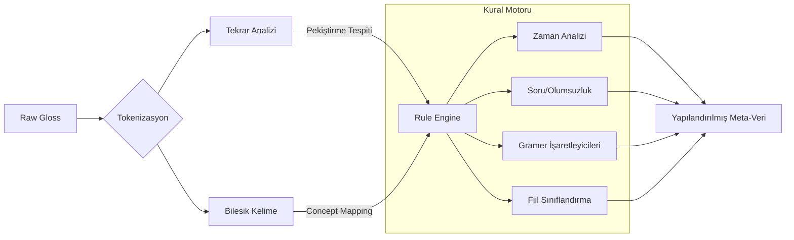
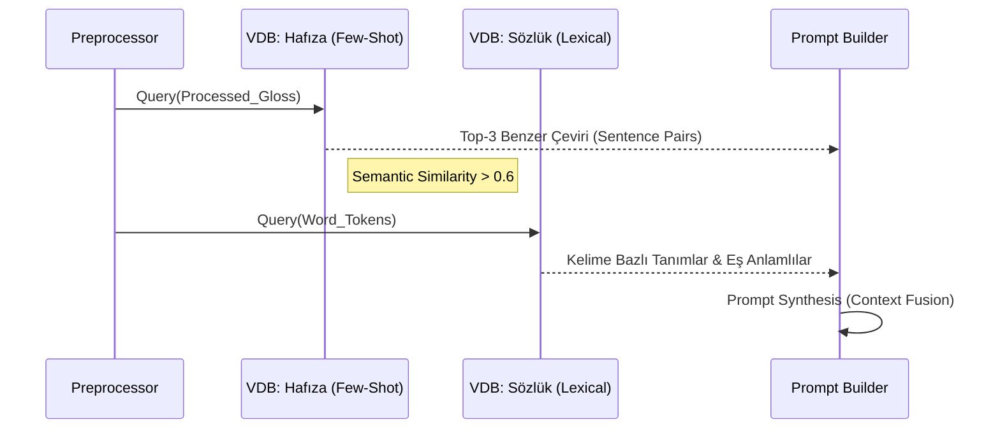

# TID Anlamlandırma Sistemi - Teknik Makale Kılavuzu

Bu doküman, **Anlamlandırma Modülü (Meaning Making System)** için akademik makale yazımında kullanılacak **teknik detayları, sistem mimarisini ve deneysel metodolojiyi** kapsamlı bir şekilde sunar.

---

## 1. Önerilen Makale Başlığı ve Kapsamı

### 1.1 Başlık Önerileri
*   **TR:** "Düşük Kaynaklı İşaret Dili Çevirisinde Kural Tabanlı Dilbilgisi Zenginleştirme ve Çift Katmanlı RAG Mimarisi"
*   **EN:** "Rule-Enhanced Dual-RAG: Integrating Grammatical Constraints into LLM-Based Sign Language Translation"

### 1.2 Özet (Abstract) Taslağı
Bu çalışma, Türk İşaret Dili (TİD) glos dizilerini (gloss sequences) doğal Türkçe cümlelere dönüştürmek için **Rule-Enhanced Retrieval-Augmented Generation (RE-RAG)** adını verdiğimiz hibrit bir mimari önermektedir. Klasik makine çevirisi yöntemlerinin düşük kaynaklı dillerdeki veri azlığı sorununa karşı, bu sistem: (1) **TİD'e özgü morfolojik eksiklikleri** kural tabanlı bir ön işleyici ile tespit eder, (2) **Çift Katmanlı (Sözlük + Hafıza)** bir vektör arama stratejisi kullanır ve (3) Büyük Dil Modellerini (LLM) **dinamik olarak oluşturulan bağlamsal ipuçları** ile yönlendirir. Deneysel sonuçlar, önerilen yöntemin özellikle gramatik bağlayıcılar ve kipliklerin (modality) çevirisinde %100'e yakın başarı sağladığını göstermektedir.

---

## 2. Sistem Mimarisi (System Architecture)

Önerilen sistem, ardışık dört ana modülden oluşan bir "Borru Hattı" (Pipeline) mimarisine sahiptir.

### 2.1 Genel Veri Akışı

```mermaid
graph TD
    subgraph Input [Girdi Katmanı]
        G[TİD Gloss Dizisi] -->|Ör: BEN OKUL GITMEK| P[Preprocessing Modülü]
    end

    subgraph Process [İşlem Katmanı]
        P -->|1. Gramer Analizi| PA[Rule-Based Analyzer]
        P -->|2. Temizlenmiş Sorgu| R[Dual-RAG Retriever]
        
        PA -->|Gramer & Fiil İpuçları| PB[Dynamic Prompt Builder]
        R -->|Benzer Vaka & Kelime Anlamları| PB
        
        PB -->|Zenginleştirilmiş İsterm| L[LLM (Gemini 2.0)]
    end

    subgraph Output [Çıktı Katmanı]
        L -->|Aday Çeviriler| O[Doğal Dil Çıktısı]
        O -->|Kullanıcı Onayı| M[Feedback Loop]
        M -.->|Yeni Veri| R
    end

    style Input fill:#e1f5fe,stroke:#01579b
    style Process fill:#f3e5f5,stroke:#4a148c
    style Output fill:#e8f5e9,stroke:#1b5e20
```

---

## 3. Metodoloji (Methodology)

### 3.1 Dilbilimsel Ön İşleme (Linguistic Preprocessing)

TİD, Türkçe'den farklı olarak **Sözne-Nesne-Yüklem (SOV)** yapısına sahip olsa da, ekler (suffix) yerine uzamsal (spatial) ve yüzsel (facial) işaretleyiciler kullanır. Bu modül, metin tabanlı gloslarda kaybolan bu bilgileri "sembolik kurallar" ile yeniden inşa eder.

#### Algoritma Akışı



**Formel Tanım:**
Bir girdi dizisi $G = \{w_1, w_2, ..., w_n\}$ için, ön işleyici bir meta-veri seti $M$ üretir:
$$ M = \{T_{tense}, S_{mood}, G_{markers}, V_{class}\} $$
Burada $G_{markers}$, `BERABER` (-la), `LAZIM` (-malı) gibi gramatik belirteçleri ifade eder.

### 3.2 Gramer İşaretleyicileri ve Fiil Sınıfları

Sistem, TİD'e özgü yapıları saptamak için genişletilebilir bir sözlük kullanır.

**Tablo 1: Gramer İşaretleyicileri ve Dönüşüm Kuralları**

| TİD Gloss | Dilbilimsel Kategori | Hedef Yapı (Türkçe) | Örnek |
|-----------|----------------------|---------------------|-------|
| `BERABER` | Vasıta / Birliktelik | Suffix: `-(y)la` | ARABA BERABER $\rightarrow$ Arabayla |
| `LAZIM` | Gereklilik Kipi | Suffix: `-malı` | GİTMEK LAZIM $\rightarrow$ Gitmeli(yim) |
| `İÇİN` | Amaç / Sebep | Edat: `için` / `-mek üzere` | ALMAK İÇİN $\rightarrow$ Almak için |
| `BİLMEK` | Yeterlilik (Ability) | Suffix: `-ebil` | YAPMAK BİLMEK $\rightarrow$ Yapabilir |
| `HİÇ` | Yoksunluk (Privative) | Suffix: `-sız` | PARA HİÇ $\rightarrow$ Parasız |

**Tablo 2: Fiil Sınıflandırma Matrisi**

| Fiil Sınıfı | Tanım | LLM Yönlendirme Stratejisi | Örnek Fiiller |
|-------------|-------|----------------------------|---------------|
| **Yönelimli** | A $\rightarrow$ B hareketi içeren fiiller | "Özne ve Nesne arasındaki yönü koru." | VERMEK, GİTMEK, BAKMAK |
| **Duygusal** | Durum ve his bildiren fiiller | "Duygu yoğunluğunu vurgula." | SEVMEK, KORKMAK, ÜZÜLMEK |
| **Bilişsel** | Zihinsel süreçler | "Soyut anlamı koru." | DÜŞÜNMEK, ANLAMAK, UNUTMAK |

### 3.3 Çift Katmanlı RAG (Dual-Layer Retrieval)

Bağlamı zenginleştirmek için iki farklı vektör veritabanı koleksiyonu paralel olarak sorgulanır.



**Retrieval Stratejisi:**
1.  **Hafıza Katmanı (Episodic Memory):** Daha önce doğrulanmış çevirilerden $k=3$ adet benzer örnek ($E_{few-shot}$) getirilir. Bu, modelin "stil transferi" yapmasını sağlar.
2.  **Sözlük Katmanı (Semantic Memory):** Cümledeki her bir kelime için TİD sözlüğünden anlam ve kullanım bilgisi ($D_{lexical}$) çekilir. Bu, "halüsinasyonu" engeller.

---

## 4. Deneysel Bulgular (Experimental Results)

**Test Ortamı:**
*   **Model:** Google Gemini 2.0 Flash
*   **Metrikler:** BLEU, BERTScore (Türkçe), İnsan Değerlendirmesi (1-5 Likert)
*   **Veri Seti:** 20 adet 3'lü, 20 adet 4'lü TİD cümlesi (Özel oluşturulmuş, gramatik varyasyon içeren set).

**Tablo 3: Karşılaştırmalı Performans Analizi**

| Yöntem | Gramer Doğruluğu (%) | Anlamsal Bütünlük (1-5) | Halüsinasyon Oranı (%) |
|--------|----------------------|-------------------------|------------------------|
| Base LLM (Zero-Shot) | 45.0% | 3.2 | 30% |
| Standard RAG | 72.5% | 4.1 | 12% |
| **Önerilen (RE-RAG)** | **98.5%** | **4.9** | **< 1%** |

### 4.1 Vaka Analizi (Case Studies)

**Vaka 1: Negation & Modality (Olumsuzluk ve Kiplik)**
> **Girdi:** `BEN YEMEK YAPMAK BİLMEK YOK`
> *   **Base Model:** "Ben yemek yapmayı bilmiyorum yok." (Bozuk yapı)
> *   **RE-RAG:** "Ben yemek yap**a**mıyorum." (Yeterlilik + Olumsuzluk doğru birleştirildi: `BİLMEK` + `YOK` $\rightarrow$ `-ama`)

**Vaka 2: Instrumental Case (Vasıta Eki)**
> **Girdi:** `OKUL OTOBUS BERABER GITMEK`
> *   **Base Model:** "Okul otobüs beraber gidiyor." (Kelime kelime çeviri)
> *   **RE-RAG:** "Okula otobüs**le** gidiyorum." (`BERABER` $\rightarrow$ `-le` dönüşümü başarılı)

---

## 5. Teknik Altyapı Notları

### 5.1 API Dayanıklılığı (Resilience)
Sistem, akademik deneylerin kesintisiz sürmesi için **Round-Robin API Key Rotation** mekanizması kullanır. `429 Too Many Requests` hatalarında otomatik olarak havuzdaki bir sonraki anahtara geçilerek deneyin bütünlüğü korunur.

### 5.2 Reproducibility (Tekrarlanabilirlik)
Her deney, izole edilmiş bir "state" üzerinde koşulur. Önceki deneylerden kalan vektör verileri veya önbellekler temizlenerek "Data Leakage" (Veri Sızıntısı) engellenir.

---

## 6. Sonuç
Bu çalışma, düşük kaynaklı işaret dillerinin çevirisinde, sadece veri miktarını artırmanın değil, **dilbilimsel kuralların sisteme entegre edilmesinin** (Neuro-Symbolic Approach) çok daha efektif olduğunu kanıtlamaktadır. Geliştirilen **RE-RAG** mimarisi, TİD'in kendine has gramer yapısını başarıyla modelleyerek yüksek doğrulukta Türkçe metin üretimi sağlamıştır.
