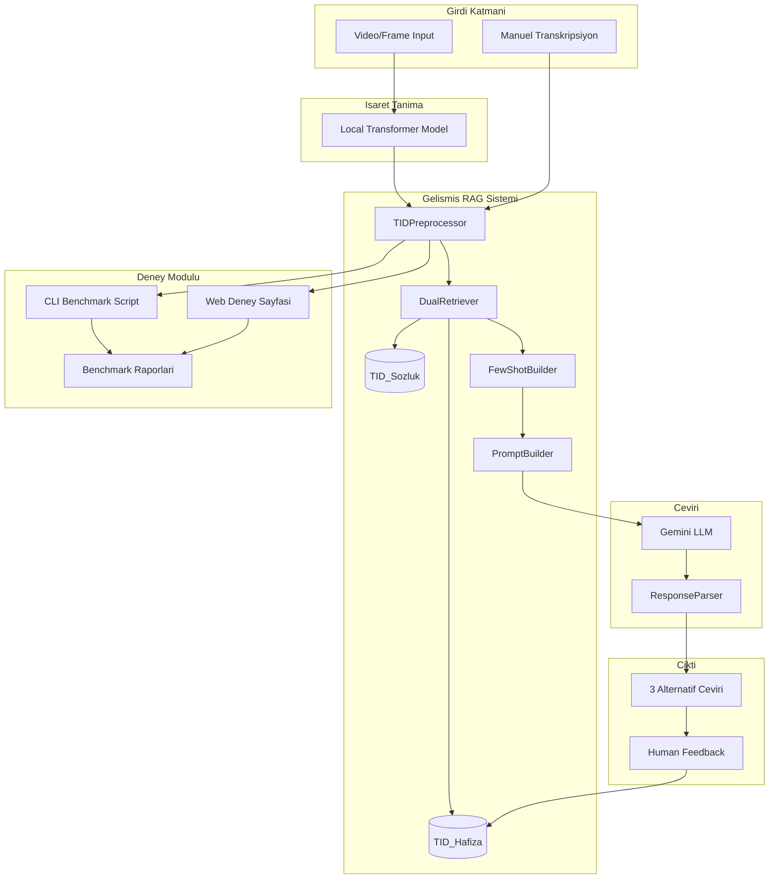

# Anlamlandirma Sistemi RAG Entegrasyonu ve Deney Modulu

## Mevcut Durum Analizi

### TRANSKRIPSIYON-RAG-VDB (Kaynak Sistem)

- Dual-collection RAG: TID_Sozluk (2867 kelime) + TID_Hafiza (2845 ceviri)
- Gelismis TID preprocessor (zaman, soru, olumsuzluk, tekrar tespiti)
- ChromaDB vektor veritabani
- 3 alternatif ceviri ureten prompt builder
- BLEU ve BERTScore degerlendirme
- Streamlit dashboard

### anlamlandirma-sistemi (Hedef Sistem)

- Flask web uygulamasi ([app.py](anlamlandirma-sistemi/app.py))
- Basit TF-IDF RAG ([rag_simple.py](anlamlandirma-sistemi/rag_simple.py))
- Temel regex preprocessor ([preprocessor.py](anlamlandirma-sistemi/preprocessor.py))
- Video isaret tanima modeli entegrasyonu

---

## Entegrasyon Mimarisi



---

## Uygulama Adimlari

### Adim 1: RAG Modullerinin Kopyalanmasi

Asagidaki klasorler `anlamlandirma-sistemi/rag/` altina kopyalanacak:

- `preprocessing/` - TID preprocessor
- `tid_collections/` - ChromaDB koleksiyonlari
- `retriever/` - DualRetriever
- `prompt_builder/` - Few-shot ve template builder
- `llm/` - LLM client ve response parser
- `pipeline/` - TranslationPipeline orchestrator
- `feedback/` - Human-in-the-loop
- `evaluation/` - Benchmark modulu

### Adim 2: Dosya Degisiklikleri

#### [preprocessor.py](anlamlandirma-sistemi/preprocessor.py) - Tamamen Yeniden Yazilacak

```python
# Yeni preprocessor.py - RAG entegrasyonu
from rag.pipeline import TranslationPipeline
from rag.preprocessing.tid_preprocessor import TIDPreprocessor

_pipeline = None

def get_pipeline():
    global _pipeline
    if _pipeline is None:
        _pipeline = TranslationPipeline(provider="gemini")
    return _pipeline

def preprocess_text_for_llm(transcription: str) -> str:
    preprocessor = TIDPreprocessor()
    result = preprocessor.preprocess(transcription)
    return result.processed

def create_final_prompt(processed_transcription: str) -> str:
    pipeline = get_pipeline()
    # RAG-augmented prompt olustur
    ...
```

#### [rag_simple.py](anlamlandirma-sistemi/rag_simple.py) - Silinecek/Yerine DualRetriever

#### [llm_services.py](anlamlandirma-sistemi/llm_services.py) - ResponseParser entegrasyonu

### Adim 3: Deney Modulu Olusturulmasi

#### CLI Script: `anlamlandirma-sistemi/experiments/run_experiments.py`

```python
# Kelime sayisina gore filtrelenmis test setleri
# 3-kelime, 4-kelime, 5-kelime deneyleri
# BLEU ve BERTScore metrikleri
# JSON/CSV rapor ciktisi
```

#### Web Arayuzu: `anlamlandirma-sistemi/templates/experiments.html`

- Kelime sayisi secimi (3/4/5)
- Toplu test calistirma
- Sonuc gorsellestirme
- Benchmark karsilastirma

### Adim 4: Test Seti Olusturulmasi

`anlamlandirma-sistemi/experiments/test_sets/` klasorunde:

- `3_word_glosses.json` - 20 adet 3 kelimelik transkripsiyon
- `4_word_glosses.json` - 20 adet 4 kelimelik transkripsiyon
- `5_word_glosses.json` - 20 adet 5 kelimelik transkripsiyon

Veri kaynaklari:

- Mevcut `test_glosses.json` filtrelenmis
- TID_Sozluk ornek cumleleri
- Manuel eklenen ornekler

### Adim 5: Benchmark ve Raporlama

- BLEU Score hesaplama
- BERTScore (Turkce) hesaplama
- Kelime sayisina gore performans karsilastirmasi
- Eski sistem vs Yeni RAG sistem karsilastirmasi
- Markdown ve JSON formatinda rapor ciktisi

### Adim 6: Dokumantasyon

- `anlamlandirma-sistemi/RAG_ENTEGRASYON.md` - Teknik dokumantasyon
- `anlamlandirma-sistemi/DENEY_KILAVUZU.md` - Deney calistirma kilavuzu
- Kod icinde detayli yorumlar

---

## Dosya Yapisi (Son Hali)

```
anlamlandirma-sistemi/
├── app.py                          # Flask app (guncellenmis)
├── preprocessor.py                 # RAG-tabanli (yeniden yazilmis)
├── llm_services.py                 # ResponseParser entegreli
├── rag/                            # Yeni RAG modulu
│   ├── __init__.py
│   ├── config.py
│   ├── preprocessing/
│   │   └── tid_preprocessor.py
│   ├── tid_collections/
│   │   ├── sozluk_collection.py
│   │   └── hafiza_collection.py
│   ├── retriever/
│   │   └── dual_retriever.py
│   ├── prompt_builder/
│   │   ├── system_instructions.py
│   │   ├── few_shot_builder.py
│   │   └── templates.py
│   ├── llm/
│   │   ├── llm_client.py
│   │   └── response_parser.py
│   ├── pipeline/
│   │   └── translation_pipeline.py
│   └── feedback/
│       └── feedback_handler.py
├── experiments/                    # Deney modulu
│   ├── __init__.py
│   ├── run_experiments.py          # CLI script
│   ├── experiment_runner.py        # Core deney logic
│   ├── report_generator.py         # Rapor olusturucu
│   └── test_sets/
│       ├── 3_word_glosses.json
│       ├── 4_word_glosses.json
│       └── 5_word_glosses.json
├── vectorstore/                    # ChromaDB verileri
├── templates/
│   ├── experiments.html            # Deney web arayuzu
│   └── ...
├── RAG_ENTEGRASYON.md
├── DENEY_KILAVUZU.md
└── requirements.txt                # Guncellenmis bagimliliklar
```

---

## Kritik Entegrasyon Noktalari

### 1. app.py Degisiklikleri

```python
# Yeni endpoint
@app.route('/experiments', methods=['GET'])
def experiments_page():
    ...

@app.route('/api/run_experiment', methods=['POST'])
def run_experiment():
    word_count = request.json.get('word_count', 3)
    # Deney calistir ve sonuclari dondur
```

### 2. Video Model Entegrasyonu

Gercek zamanli model ciktilari icin `process_frame_sequence()` fonksiyonundan gelen transkripsiyon dogrudan yeni RAG pipeline'a yonlendirilecek.

### 3. Requirements Guncellemesi

Eklenmesi gereken bagimliliklar:

- `chromadb>=0.4.0`
- `sentence-transformers>=2.2.0`
- `sacrebleu>=2.3.0`
- `bert-score>=0.3.13`

---

## Beklenen Ciktilar

1. Tam entegre RAG sistemi
2. 3/4/5 kelimelik deney CLI scripti
3. Web tabanli deney arayuzu
4. Her kelime sayisi icin 20 orneklik test seti
5. Benchmark raporlari (BLEU, BERTScore)
6. Eski vs Yeni sistem karsilastirma raporu
7. Teknik dokumantasyon
